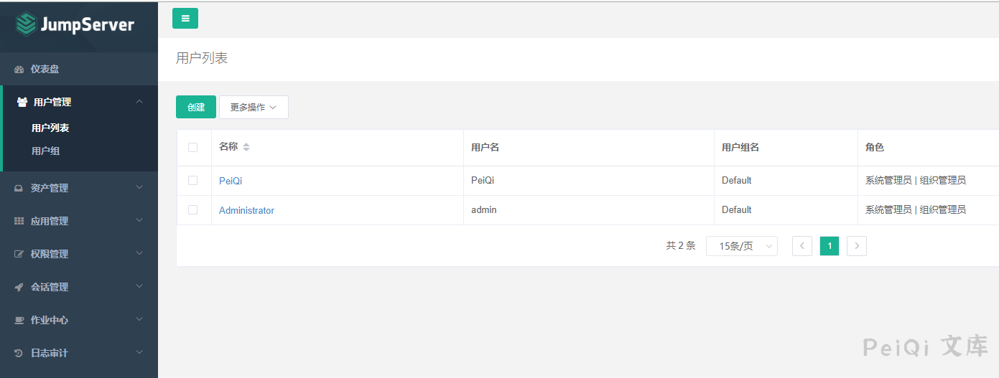
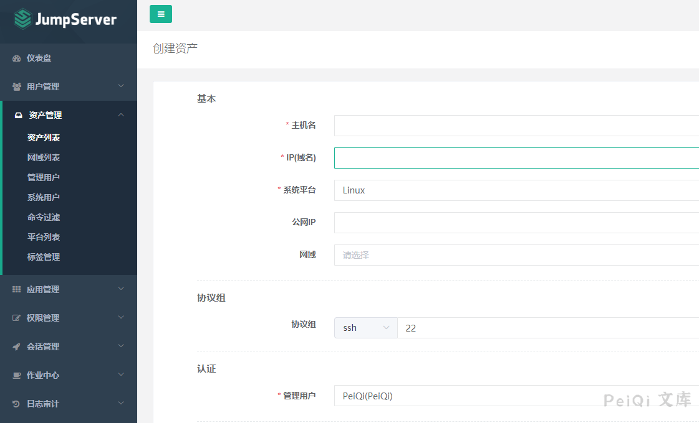
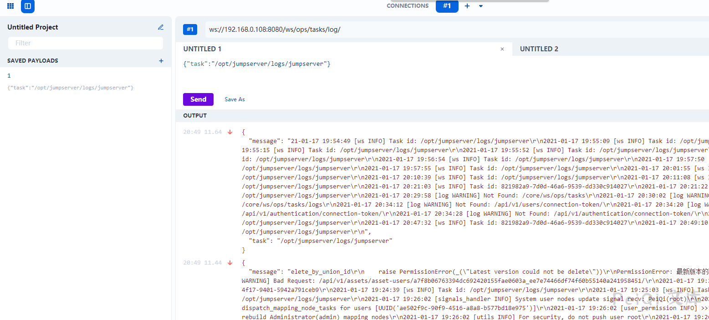
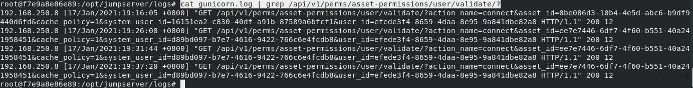
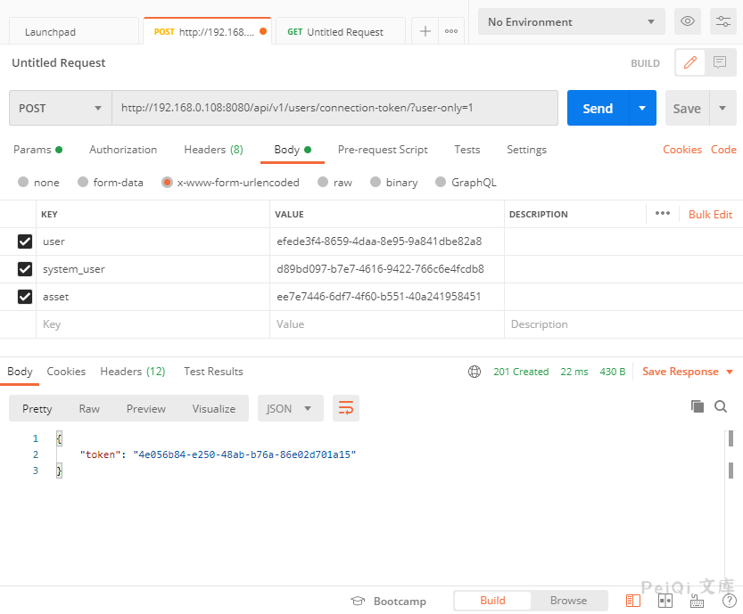
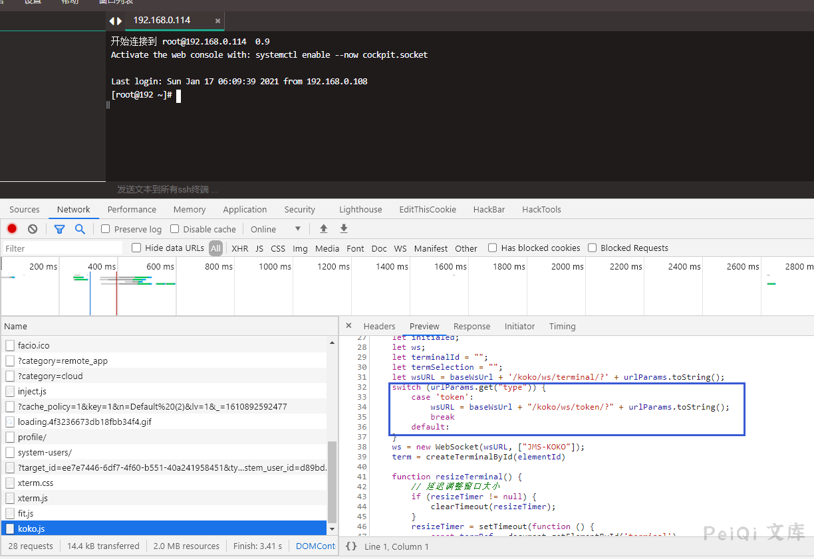

# JumpServer 未授权接口 远程命令执行漏洞

## 漏洞描述

JumpServer 是全球首款完全开源的堡垒机, 使用GNU GPL v2.0 开源协议, 是符合4A 的专业运维审计系统。 JumpServer 使用Python / Django 进行开发。2021年1月15日，阿里云应急响应中心监控到开源堡垒机JumpServer发布更新，修复了一处远程命令执行漏洞。由于 JumpServer 某些接口未做授权限制，攻击者可构造恶意请求获取到日志文件获取敏感信息，或者执行相关API操作控制其中所有机器。

## 漏洞影响

<a-checkbox checked>JumpServer < v2.6.2</a-checkbox></br>

<a-checkbox checked>JumpServer < v2.5.4</a-checkbox></br>

<a-checkbox checked>JumpServer < v2.4.5</a-checkbox></br>

<a-checkbox checked>JumpServer = v1.5.9</a-checkbox></br>

## 网络测绘

<a-checkbox checked>app="FIT2CLOUD-JumpServer-堡垒机"</a-checkbox></br>

## 环境搭建

安装 JumpServer v2.6.1 版本

[下载链接](https://www.o2oxy.cn/wp-content/uploads/2021/01/quick_start.zip)

<a-checkbox checked>安装注意 配置网络，配置Mysql，配置Redis 选择 n</a-checkbox></br>

等待完成安装执行以下命令

```shell
cd /opt/jumpserver-installer-v2.6.1
./jmsctl.sh start
```

等待安装完毕访问 http://xxx.xxx.xxx.xxxx:8080

默认账号密码 amdin:admin

## 漏洞复现

进入后台添加配置

`资产管理 -->  系统用户`


`资产管理 --> 管理用户`


`用户管理 --> 用户列表`




`资产管理 --> 资产列表`




查看一下项目代码提交变动


```python
import time
import os
import threading
import json

from common.utils import get_logger

from .celery.utils import get_celery_task_log_path
from channels.generic.websocket import JsonWebsocketConsumer

logger = get_logger(__name__)


class CeleryLogWebsocket(JsonWebsocketConsumer):
    disconnected = False

    def connect(self):
        user = self.scope["user"]
        if user.is_authenticated and user.is_org_admin:
            self.accept()
        else:
            self.close()

    def receive(self, text_data=None, bytes_data=None, **kwargs):
        data = json.loads(text_data)
        task_id = data.get("task")
        if task_id:
            self.handle_task(task_id)

    def wait_util_log_path_exist(self, task_id):
        log_path = get_celery_task_log_path(task_id)
        while not self.disconnected:
            if not os.path.exists(log_path):
                self.send_json({'message': '.', 'task': task_id})
                time.sleep(0.5)
                continue
            self.send_json({'message': '\r\n'})
            try:
                logger.debug('Task log path: {}'.format(log_path))
                task_log_f = open(log_path, 'rb')
                return task_log_f
            except OSError:
                return None

    def read_log_file(self, task_id):
        task_log_f = self.wait_util_log_path_exist(task_id)
        if not task_log_f:
            logger.debug('Task log file is None: {}'.format(task_id))
            return

        task_end_mark = []
        while not self.disconnected:
            data = task_log_f.read(4096)
            if data:
                data = data.replace(b'\n', b'\r\n')
                self.send_json(
                    {'message': data.decode(errors='ignore'), 'task': task_id}
                )
                if data.find(b'succeeded in') != -1:
                    task_end_mark.append(1)
                if data.find(bytes(task_id, 'utf8')) != -1:
                    task_end_mark.append(1)
            elif len(task_end_mark) == 2:
                logger.debug('Task log end: {}'.format(task_id))
                break
            time.sleep(0.2)
        task_log_f.close()

    def handle_task(self, task_id):
        logger.info("Task id: {}".format(task_id))
        thread = threading.Thread(target=self.read_log_file, args=(task_id,))
        thread.start()

    def disconnect(self, close_code):
        self.disconnected = True
        self.close()
```


新版对用户进行了一个判断，可以使用 谷歌插件 WebSocket King 连接上这个websocket 进行日志读取




比如send这里获取的 Task id ,这里是可以获得一些敏感的信息的


查看一下连接Web终端的后端api代码


可以看到这里调用时必须需要 `user asset system_user` 这三个值，再获取一个20秒的 `token`

访问web终端后查看日志的调用


```plain
docker exec -it (jumpserve/core的docker) /bin/bash
cat gunicorn.log | grep /api/v1/perms/asset-permissions/user/validate/?
```




```plain
assset_id=ee7e7446-6df7-4f60-b551-40a241958451
system_user_id=d89bd097-b7e7-4616-9422-766c6e4fcdb8	
user_id=efede3f4-8659-4daa-8e95-9a841dbe82a8
```


可以看到在不同的时间访问这个接口的asset_id等都是一样的，所以只用在 `刚刚的未授权日志读取`里找到想要的这几个值就可以获得 token


发送请求获取20s的token





看一下 koko.js 这个前端文件




<br/>

<a-alert type="success" message="后端代码 https://github.com/jumpserver/koko/blob/e054394ffd13ac7c71a4ac980340749d9548f5e1/pkg/httpd/webserver.go" description="" showIcon>
</a-alert>
<br/>

​	


这里我们就可以通过 获得的token来模拟请求


成功连接模拟了这个 token 的请求,可以在Network看一下流量是怎么发送的


模拟连接发送和接发数据


这里可以看到我们只要模拟了这个发送，返回的数据和web终端是一样的，那我们就可以通过这样的方法来进行命令执行了