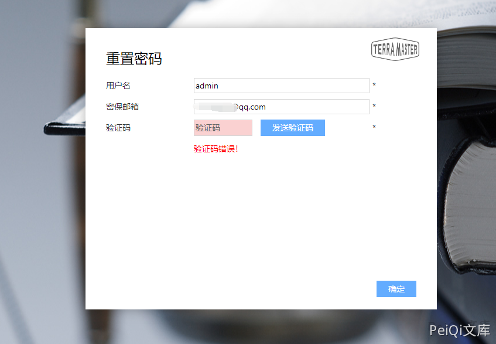

# TerraMaster TOS 任意账号密码修改漏洞 CVE-2020-28186

## 漏洞描述

TerraMaster TOS <= 4.2.06中的电子邮件注入允许未经身份验证的远程攻击者利用忘记密码功能，重置账号密码实现账号接管。

## 漏洞影响

<a-checkbox checked>TerraMaster TOS < 4.2.06</a-checkbox> 

## 网络测绘

<a-checkbox checked>"TerraMaster" && header="TOS"</a-checkbox> 

## 漏洞复现

首先需要知道已知用户名，可以参考 TerraMaster TOS 用户枚举漏洞 CVE-2020-28185 获取已知的用户名

重置页面输入获取的账号和邮箱

点击确定，抓包更换邮箱接收验证码

通过接收的验证码即可更换账号密码登录后台

