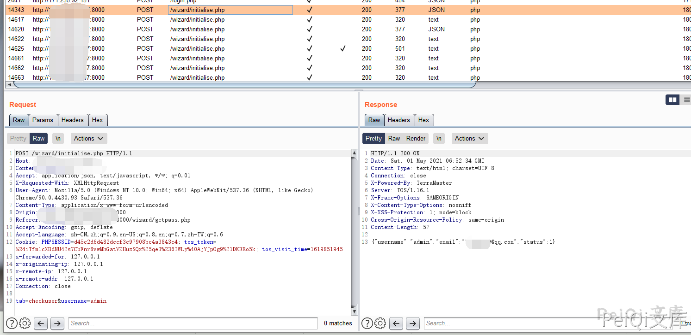

# TerraMaster TOS 用户枚举漏洞 CVE-2020-28185

## 洞描述

TerraMaster TOS 存在用户枚举漏洞，通过wizard/initialise.php页面的username参数即可枚举系统中的用户，以及泄露邮箱信息

## 漏洞影响

<a-checkbox checked>TerraMaster TOS < 4.2.06</a-checkbox> 

## 网络测绘

<a-checkbox checked>"TerraMaster" && header="TOS"</a-checkbox> 

## 漏洞复现

漏洞点来源于找回密码的用户存在校验

输入用户名 admin 点击确定，查看Burp捕获的包

其中有一个请求包用于确认用户admin是否存在

存在则返回用户的邮箱信息