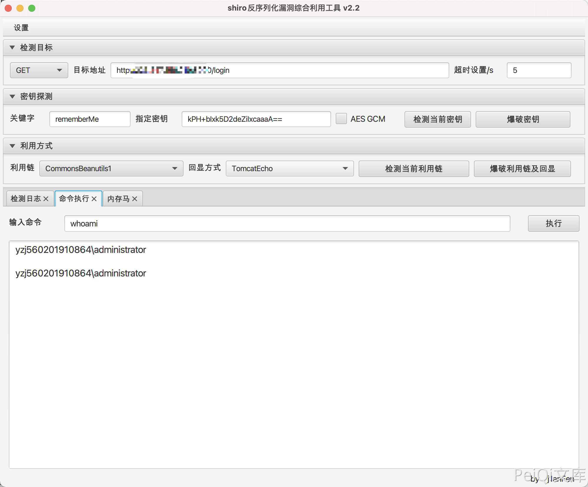

# 云时空 社会化商业ERP系统 Shiro框架 远程命令执行漏洞

## 漏洞描述

云时空 社会化商业ERP为 Shiro框架 ，使用了默认的密钥导致了远程命令执行漏洞

## 漏洞影响

<a-checkbox checked>云时空 社会化商业ERP系统</a-checkbox></br>

## 网络测绘

<a-checkbox checked>title="云时空社会化商业ERP"</a-checkbox></br>

## 漏洞复现

登录页面


默认密钥为

```python
kPH+bIxk5D2deZiIxcaaaA==
```

