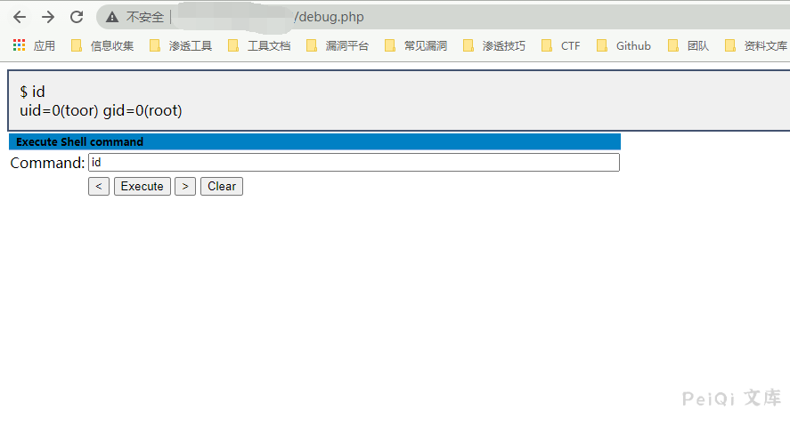

# 蓝海卓越 计费管理系统 debug.php 远程命令执行漏洞

## 漏洞描述

蓝海卓越计费管理系统 debug.php 存在命令调试页面，导致攻击者可以远程命令执行

## 漏洞影响

<a-checkbox checked>蓝海卓越计费管理系统</a-checkbox> 

## 网络测绘

<a-checkbox checked>title=="蓝海卓越计费管理系统"</a-checkbox> 

## 漏洞复现

登录页面如下

漏洞代码

访问 `debug.php页面` 远程调试命令执行

