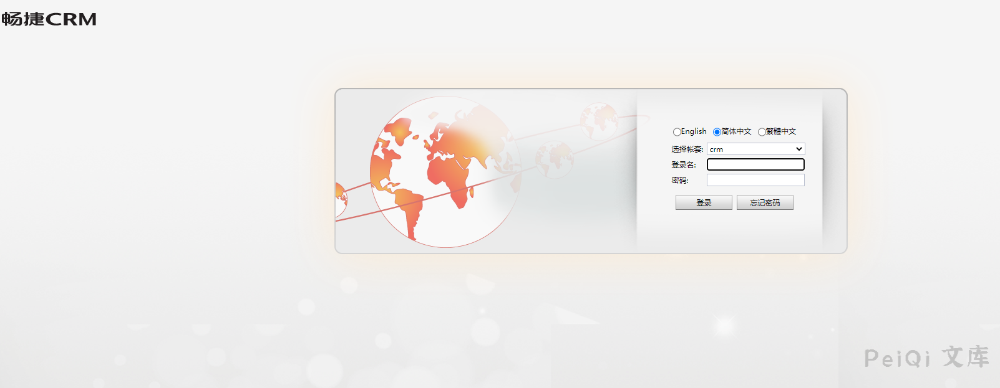
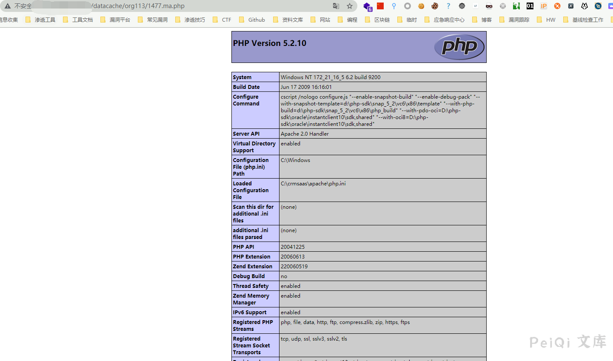

# 畅捷CRM 后台附件任意文件上传漏洞

## 漏洞描述

畅捷CRM 后台附件存在任意文件上传漏洞，通过解析漏洞可跳过后缀更改获取网站权限

## 漏洞影响

<a-checkbox checked>畅捷CRM</a-checkbox> 

## 网络测绘

<a-checkbox checked>title="畅捷CRM"</a-checkbox> 

## 漏洞复现

登录页面

部分存在空密码 admin/空密码

登录后添加客户，并上传附件为PHP文件，其中文件名为 xxx.xxx.php格式，越过系统中的后缀更改

点击文件名跳转

